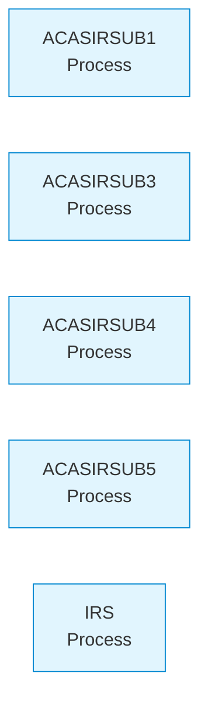

# IRS Module - System Visualizations

**Generated from Code**: 2025-09-15T16:57:46.777Z

## 1. System Context Diagram

```mermaid
graph TB
    %% Context Diagram - Generated from actual CALL analysis
    %% Subsystem: IRS_Module
    %% Internal Programs: 18
    %% External Dependencies: 12

    classDef internal fill:#e1f5e1,stroke:#4caf50,stroke-width:2px
    classDef external fill:#ffe0e0,stroke:#f44336,stroke-width:2px
    classDef subsystem fill:#e3f2fd,stroke:#2196f3,stroke-width:3px

    subgraph IRSModule["IRS Module"]
        acasirsub1["ACASIRSUB1"]
        acasirsub3["ACASIRSUB3"]
        acasirsub4["ACASIRSUB4"]
        acasirsub5["ACASIRSUB5"]
        irs["IRS"]
        more["... and 13 more programs"]
    end

    fhlogger["fhlogger"]:::external
    irsnominalMT["irsnominalMT"]:::external
    irsdfltMT["irsdfltMT"]:::external
    irspostingMT["irspostingMT"]:::external
    irsfinalMT["irsfinalMT"]:::external
    CBLCHECKFILEEXIST["CBL_CHECK_FILE_EXIST"]:::external
    SYSTEM["SYSTEM"]:::external
    maps04["maps04"]:::external
    irsubn["irsubn"]:::external
    scrdump["scr_dump"]:::external
    acasirsub1 --> irsnominalMT
    acasirsub1 --> fhlogger
    acasirsub3 --> irsdfltMT
    acasirsub3 --> fhlogger
    acasirsub4 --> irspostingMT
    acasirsub4 --> fhlogger
    acasirsub5 --> irsfinalMT
    acasirsub5 --> fhlogger
    irs --> maps04
    irs --> CBLCHECKFILEEXIST
    irs --> irs000
    irs --> irs010
    irs --> irs020
    irs --> irs030
    irs --> irs040
    irs --> irs050
    irs --> irs065
    irs --> irs060
    irs --> irs070
    irs --> irs085

    class IRSModule subsystem
    class acasirsub1 internal
    class acasirsub3 internal
    class acasirsub4 internal
    class acasirsub5 internal
    class irs internal
```

**Evidence**: Generated from 50 actual CALL statements in code
**Confidence**: 1.0 (from parsed AST)

## 2. Program Flow Diagrams

### ACASIRSUB1 Flow

```mermaid
flowchart TD
    %% Program Flow - acasirsub1
    %% Generated from PERFORM/GOTO analysis
    %% Sections: 50, PERFORMs: 0

    classDef performed fill:#e8f5e9,stroke:#4caf50
    classDef dead fill:#ffebee,stroke:#f44336
    classDef entry fill:#fff3e0,stroke:#ff9800

    Start([Start]):::entry
    S0["input-output<br/>Line: 157"]:::performed
    S1["file-control<br/>Line: 158"]:::dead
    S2["file<br/>Line: 167"]:::dead
    S3["working-storage<br/>Line: 172"]:::dead
    S4["Linkage<br/>Line: 200"]:::dead
    S5["ACAS-DAL-Common-data<br/>Line: 218"]:::dead
    S6["aa-Process-Flat-File<br/>Line: 221"]:::dead
    S7["aa010-main<br/>Line: 223"]:::dead
    S8["end-evaluate<br/>Line: 246"]:::dead
    S9["end-if<br/>Line: 261"]:::dead
    S10["end-if<br/>Line: 269"]:::dead
    S11["end-evaluate<br/>Line: 310"]:::dead
    S12["aa020-Process-Open<br/>Line: 315"]:::dead
    S13["end-if<br/>Line: 361"]:::dead
    S14["aa030-Process-Close<br/>Line: 367"]:::dead
    S15["aa040-Process-Read-Next<br/>Line: 380"]:::dead
    S16["end-if<br/>Line: 396"]:::dead
    S17["aa041-Reread<br/>Line: 398"]:::dead
    S18["end-read<br/>Line: 407"]:::dead
    S19["aa045-Process-Read-Next-Raw<br/>Line: 422"]:::dead
    S20["end-if<br/>Line: 437"]:::dead
    S21["end-read<br/>Line: 447"]:::dead
    S22["aa047-Eval-Keys<br/>Line: 464"]:::dead
    S23["end-evaluate<br/>Line: 480"]:::dead
    S24["aa050-Process-Read-Indexed<br/>Line: 482"]:::dead
    S25["aa051-Reread<br/>Line: 493"]:::dead
    S26["aa060-Process-Start<br/>Line: 514"]:::dead
    S27["WE-Error<br/>Line: 520"]:::dead
    S28["Key-1<br/>Line: 523"]:::dead
    S29["aa070-Process-Write<br/>Line: 568"]:::dead
    S30["aa080-Process-Delete<br/>Line: 607"]:::dead
    S31["aa090-Process-Rewrite<br/>Line: 628"]:::dead
    S32["aa170-Process-Write-Raw<br/>Line: 638"]:::dead
    S33["end-write<br/>Line: 655"]:::dead
    S34["aa100-Bad-Function<br/>Line: 658"]:::dead
    S35["aa999-main-exit<br/>Line: 665"]:::dead
    S36["end-if<br/>Line: 668"]:::dead
    S37["aa-main-exit<br/>Line: 670"]:::dead
    S38["aa-Exit<br/>Line: 673"]:::dead
    S39["ba-Process-RDBMS<br/>Line: 676"]:::dead
    S40["ba010-Test-WS-Rec-Size<br/>Line: 684"]:::dead
    S41["ba012-Test-WS-Rec-Size-2<br/>Line: 692"]:::dead
    S42["end-if<br/>Line: 732"]:::dead
    S43["ba015-Test-Ends<br/>Line: 734"]:::dead
    S44["end-if<br/>Line: 743"]:::dead
    S45["ba020-Process-DAL<br/>Line: 752"]:::dead
    S46["end-call<br/>Line: 757"]:::dead
    S47["ba-rdbms-exit<br/>Line: 761"]:::dead
    S48["exit<br/>Line: 762"]:::dead
    S49["ACAS-DAL-Common-data<br/>Line: 769"]:::dead
    Start --> S0
    S0 --> S1
    S1 --> S2
    S2 --> S3
    S3 --> S4
    S4 --> S5
    S5 --> S6
    S6 --> S7
    S7 --> S8
    S8 --> S9
    S9 --> S10
    S10 --> S11
    S11 --> S12
    S12 --> S13
    S13 --> S14
    S14 --> S15
    S15 --> S16
    S16 --> S17
    S17 --> S18
    S18 --> S19
    S19 --> S20
    S20 --> S21
    S21 --> S22
    S22 --> S23
    S23 --> S24
    S24 --> S25
    S25 --> S26
    S26 --> S27
    S27 --> S28
    S28 --> S29
    S29 --> S30
    S30 --> S31
    S31 --> S32
    S32 --> S33
    S33 --> S34
    S34 --> S35
    S35 --> S36
    S36 --> S37
    S37 --> S38
    S38 --> S39
    S39 --> S40
    S40 --> S41
    S41 --> S42
    S42 --> S43
    S43 --> S44
    S44 --> S45
    S45 --> S46
    S46 --> S47
    S47 --> S48
    S48 --> S49
    S49 --> End([End])
```

**Evidence**: From 50 sections, 0 PERFORM statements
**Warning**: 49 potentially dead code sections detected
### ACASIRSUB3 Flow

```mermaid
flowchart TD
    %% Program Flow - acasirsub3
    %% Generated from PERFORM/GOTO analysis
    %% Sections: 32, PERFORMs: 0

    classDef performed fill:#e8f5e9,stroke:#4caf50
    classDef dead fill:#ffebee,stroke:#f44336
    classDef entry fill:#fff3e0,stroke:#ff9800

    Start([Start]):::entry
    S0["input-output<br/>Line: 101"]:::performed
    S1["file-control<br/>Line: 102"]:::dead
    S2["file<br/>Line: 110"]:::dead
    S3["working-storage<br/>Line: 116"]:::dead
    S4["Linkage<br/>Line: 140"]:::dead
    S5["ACAS-DAL-Common-data<br/>Line: 158"]:::dead
    S6["aa-Process-Flat-File<br/>Line: 161"]:::dead
    S7["aa010-main<br/>Line: 163"]:::dead
    S8["end-if<br/>Line: 185"]:::dead
    S9["end-evaluate<br/>Line: 216"]:::dead
    S10["aa040-Process-Read-Next<br/>Line: 259"]:::dead
    S11["end-if<br/>Line: 287"]:::dead
    S12["end-read<br/>Line: 297"]:::dead
    S13["aa070-Process-Write<br/>Line: 313"]:::dead
    S14["end-if<br/>Line: 336"]:::dead
    S15["aa100-Bad-Function<br/>Line: 341"]:::dead
    S16["aa999-main-exit<br/>Line: 348"]:::dead
    S17["end-if<br/>Line: 351"]:::dead
    S18["aa-main-exit<br/>Line: 353"]:::dead
    S19["aa-Exit<br/>Line: 356"]:::dead
    S20["ba-Process-RDBMS<br/>Line: 359"]:::dead
    S21["ba010-Test-WS-Rec-Size<br/>Line: 367"]:::dead
    S22["ba012-Test-WS-Rec-Size-2<br/>Line: 375"]:::dead
    S23["end-if<br/>Line: 415"]:::dead
    S24["ba015-Test-Ends<br/>Line: 417"]:::dead
    S25["end-if<br/>Line: 493"]:::dead
    S26["end-if<br/>Line: 514"]:::dead
    S27["ba020-Call-DAL<br/>Line: 522"]:::dead
    S28["end-call<br/>Line: 527"]:::dead
    S29["ba-rdbms-exit<br/>Line: 531"]:::dead
    S30["exit<br/>Line: 532"]:::dead
    S31["ACAS-DAL-Common-data<br/>Line: 539"]:::dead
    Start --> S0
    S0 --> S1
    S1 --> S2
    S2 --> S3
    S3 --> S4
    S4 --> S5
    S5 --> S6
    S6 --> S7
    S7 --> S8
    S8 --> S9
    S9 --> S10
    S10 --> S11
    S11 --> S12
    S12 --> S13
    S13 --> S14
    S14 --> S15
    S15 --> S16
    S16 --> S17
    S17 --> S18
    S18 --> S19
    S19 --> S20
    S20 --> S21
    S21 --> S22
    S22 --> S23
    S23 --> S24
    S24 --> S25
    S25 --> S26
    S26 --> S27
    S27 --> S28
    S28 --> S29
    S29 --> S30
    S30 --> S31
    S31 --> End([End])
```

**Evidence**: From 32 sections, 0 PERFORM statements
**Warning**: 31 potentially dead code sections detected
## 3. Data Flow Diagram

**Evidence**: Generated from 0 file operations in code
**Files**: 0 data files accessed
## 4. Call Hierarchy

```mermaid
graph TD
    %% Call Hierarchy - IRS_Module
    %% Generated from actual CALL statements

    acasirsub4["acasirsub4"]
    irspostingMT["irspostingMT"]
    acasirsub4 --> irspostingMT
    fhlogger["fhlogger"]
    acasirsub4 --> fhlogger
    acasirsub5["acasirsub5"]
    irsfinalMT["irsfinalMT"]
    acasirsub5 --> irsfinalMT
    acasirsub5 --> fhlogger
    irs["irs"]
    maps04["maps04"]
    irs --> maps04
    CBL_CHECK_FILE_EXIST["CBL_CHECK_FILE_EXIST"]
    irs --> CBL_CHECK_FILE_EXIST
    irs000["irs000"]
    irs --> irs000
    irs010["irs010"]
    irs --> irs010
    irs020["irs020"]
    irs --> irs020
    irs030["irs030"]
    irs --> irs030
    irs040["irs040"]
    irs --> irs040
    irs050["irs050"]
    irs --> irs050
    irs065["irs065"]
    irs --> irs065
    irs060["irs060"]
    irs --> irs060
    irs070["irs070"]
    irs --> irs070
    irs085["irs085"]
    irs --> irs085
    irs090["irs090"]
    irs --> irs090
    irs080["irs080"]
    irs --> irs080
    SYSTEM["SYSTEM"]
    irs --> SYSTEM
```

**Evidence**: 50 CALL relationships analyzed
**Root Programs**: acasirsub4, acasirsub5, irs

## Diagram Validation

- ✅ All diagrams generated from actual code analysis
- ✅ Source programs and line numbers traceable
- ✅ "Generated from code" watermark included
- ✅ No assumptions - only documented relationships
