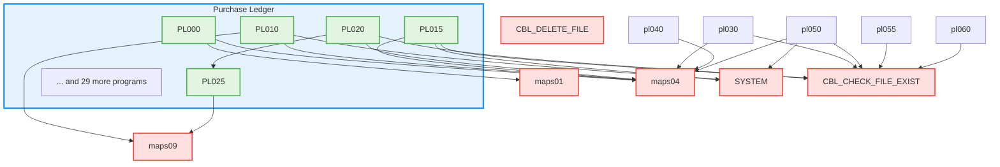
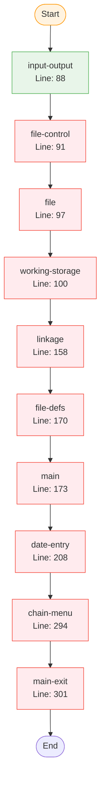
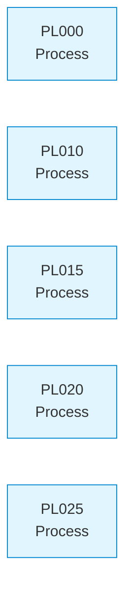
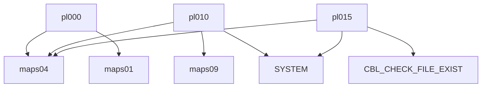

# Purchase Ledger - System Visualizations

**Generated from Code**: 2025-09-15T16:57:46.768Z

## 1. System Context Diagram

**Evidence**: Generated from 50 actual CALL statements in code
**Confidence**: 1.0 (from parsed AST)

## 2. Program Flow Diagrams

### PL000 Flow

**Evidence**: From 10 sections, 0 PERFORM statements
**Warning**: 9 potentially dead code sections detected
### PL010 Flow

```mermaid
flowchart TD
    %% Program Flow - pl010
    %% Generated from PERFORM/GOTO analysis
    %% Sections: 81, PERFORMs: 0

    classDef performed fill:#e8f5e9,stroke:#4caf50
    classDef dead fill:#ffebee,stroke:#f44336
    classDef entry fill:#fff3e0,stroke:#ff9800

    Start([Start]):::entry
    S0["input-output<br/>Line: 117"]:::performed
    S1["file-control<br/>Line: 121"]:::dead
    S2["file<br/>Line: 131"]:::dead
    S3["working-storage<br/>Line: 137"]:::dead
    S4["linkage<br/>Line: 343"]:::dead
    S5["screen<br/>Line: 352"]:::dead
    S6["file-defs<br/>Line: 482"]:::dead
    S7["init01<br/>Line: 484"]:::dead
    S8["menu-return<br/>Line: 506"]:::dead
    S9["menu-input<br/>Line: 512"]:::dead
    S10["menu-exit<br/>Line: 547"]:::dead
    S11["maps03<br/>Line: 552"]:::dead
    S12["maps09<br/>Line: 557"]:::dead
    S13["clear-error-line<br/>Line: 562"]:::dead
    S14["Report-Supplier<br/>Line: 567"]:::dead
    S15["main-end<br/>Line: 574"]:::dead
    S16["test-escape<br/>Line: 582"]:::dead
    S17["get-escape<br/>Line: 587"]:::dead
    S18["display-heading<br/>Line: 600"]:::dead
    S19["customer-display<br/>Line: 637"]:::dead
    S20["cd-exit<br/>Line: 667"]:::dead
    S21["exit<br/>Line: 668"]:::dead
    S22["display-outline<br/>Line: 670"]:::dead
    S23["Customer-Data<br/>Line: 681"]:::dead
    S24["Customer-Data-Main<br/>Line: 684"]:::dead
    S25["end-if<br/>Line: 714"]:::dead
    S26["validate-address<br/>Line: 722"]:::dead
    S27["accept-key<br/>Line: 745"]:::dead
    S28["end-if<br/>Line: 785"]:::dead
    S29["setup-suppliers<br/>Line: 790"]:::dead
    S30["customer-input<br/>Line: 803"]:::dead
    S31["customer-accept<br/>Line: 809"]:::dead
    S32["customer-details<br/>Line: 833"]:::dead
    S33["get-details<br/>Line: 852"]:::dead
    S34["main-output<br/>Line: 861"]:::dead
    S35["WS-Delivery-Record<br/>Line: 880"]:::dead
    S36["main-end<br/>Line: 883"]:::dead
    S37["amend-supplier<br/>Line: 892"]:::dead
    S38["customer-input<br/>Line: 905"]:::dead
    S39["customer-accept<br/>Line: 910"]:::dead
    S40["get-details<br/>Line: 922"]:::dead
    S41["main-output<br/>Line: 930"]:::dead
    S42["end-if<br/>Line: 973"]:::dead
    S43["end-if<br/>Line: 988"]:::dead
    S44["end-if<br/>Line: 1001"]:::dead
    S45["main-end<br/>Line: 1004"]:::dead
    S46["Evaluate-Message<br/>Line: 1013"]:::dead
    S47["delete-supplier<br/>Line: 1022"]:::dead
    S48["customer-input<br/>Line: 1029"]:::dead
    S49["customer-accept<br/>Line: 1036"]:::dead
    S50["get-details<br/>Line: 1047"]:::dead
    S51["main-output<br/>Line: 1072"]:::dead
    S52["main-end<br/>Line: 1082"]:::dead
    S53["display-suppliers<br/>Line: 1092"]:::dead
    S54["customer-input<br/>Line: 1099"]:::dead
    S55["customer-accept<br/>Line: 1104"]:::dead
    S56["accept-of-show<br/>Line: 1116"]:::dead
    S57["main-end<br/>Line: 1124"]:::dead
    S58["report-selection<br/>Line: 1134"]:::dead
    S59["accept-data<br/>Line: 1148"]:::dead
    S60["produce-report<br/>Line: 1193"]:::dead
    S61["read-loop<br/>Line: 1210"]:::dead
    S62["test-num<br/>Line: 1274"]:::dead
    S63["headings<br/>Line: 1294"]:::dead
    S64["listing<br/>Line: 1314"]:::dead
    S65["notes-print<br/>Line: 1357"]:::dead
    S66["end-report<br/>Line: 1370"]:::dead
    S67["main-end<br/>Line: 1373"]:::dead
    S68["report-heading-setup<br/>Line: 1383"]:::dead
    S69["plcreate<br/>Line: 1480"]:::dead
    S70["plcreate-Main<br/>Line: 1483"]:::dead
    S71["zz050-Validate-Date<br/>Line: 1519"]:::dead
    S72["zz050-test-date<br/>Line: 1550"]:::dead
    S73["zz050-exit<br/>Line: 1555"]:::dead
    S74["exit<br/>Line: 1556"]:::dead
    S75["zz060-Convert-Date<br/>Line: 1558"]:::dead
    S76["zz060-Exit<br/>Line: 1590"]:::dead
    S77["exit<br/>Line: 1591"]:::dead
    S78["zz070-Convert-Date<br/>Line: 1593"]:::dead
    S79["zz070-Exit<br/>Line: 1620"]:::dead
    S80["exit<br/>Line: 1621"]:::dead
    Start --> S0
    S0 --> S1
    S1 --> S2
    S2 --> S3
    S3 --> S4
    S4 --> S5
    S5 --> S6
    S6 --> S7
    S7 --> S8
    S8 --> S9
    S9 --> S10
    S10 --> S11
    S11 --> S12
    S12 --> S13
    S13 --> S14
    S14 --> S15
    S15 --> S16
    S16 --> S17
    S17 --> S18
    S18 --> S19
    S19 --> S20
    S20 --> S21
    S21 --> S22
    S22 --> S23
    S23 --> S24
    S24 --> S25
    S25 --> S26
    S26 --> S27
    S27 --> S28
    S28 --> S29
    S29 --> S30
    S30 --> S31
    S31 --> S32
    S32 --> S33
    S33 --> S34
    S34 --> S35
    S35 --> S36
    S36 --> S37
    S37 --> S38
    S38 --> S39
    S39 --> S40
    S40 --> S41
    S41 --> S42
    S42 --> S43
    S43 --> S44
    S44 --> S45
    S45 --> S46
    S46 --> S47
    S47 --> S48
    S48 --> S49
    S49 --> S50
    S50 --> S51
    S51 --> S52
    S52 --> S53
    S53 --> S54
    S54 --> S55
    S55 --> S56
    S56 --> S57
    S57 --> S58
    S58 --> S59
    S59 --> S60
    S60 --> S61
    S61 --> S62
    S62 --> S63
    S63 --> S64
    S64 --> S65
    S65 --> S66
    S66 --> S67
    S67 --> S68
    S68 --> S69
    S69 --> S70
    S70 --> S71
    S71 --> S72
    S72 --> S73
    S73 --> S74
    S74 --> S75
    S75 --> S76
    S76 --> S77
    S77 --> S78
    S78 --> S79
    S79 --> S80
    S80 --> End([End])
```

**Evidence**: From 81 sections, 0 PERFORM statements
**Warning**: 80 potentially dead code sections detected
## 3. Data Flow Diagram

**Evidence**: Generated from 0 file operations in code
**Files**: 0 data files accessed
## 4. Call Hierarchy

**Evidence**: 50 CALL relationships analyzed
**Root Programs**: pl000, pl010, pl015

## Diagram Validation

- ✅ All diagrams generated from actual code analysis
- ✅ Source programs and line numbers traceable
- ✅ "Generated from code" watermark included
- ✅ No assumptions - only documented relationships
