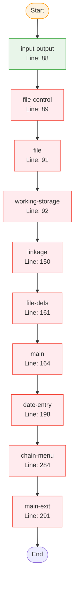
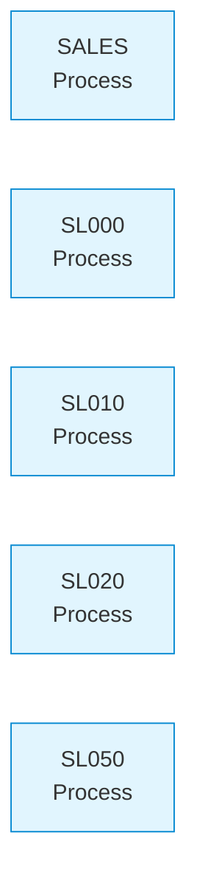
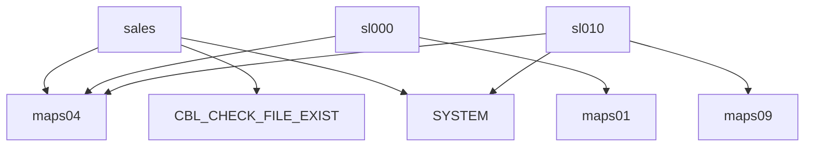

# Sales Ledger - System Visualizations

**Generated from Code**: 2025-09-15T16:57:46.758Z

## 1. System Context Diagram

```mermaid
graph TB
    %% Context Diagram - Generated from actual CALL analysis
    %% Subsystem: Sales_Ledger
    %% Internal Programs: 36
    %% External Dependencies: 9

    classDef internal fill:#e1f5e1,stroke:#4caf50,stroke-width:2px
    classDef external fill:#ffe0e0,stroke:#f44336,stroke-width:2px
    classDef subsystem fill:#e3f2fd,stroke:#2196f3,stroke-width:3px

    subgraph SalesLedger["Sales Ledger"]
        sales["SALES"]
        sl000["SL000"]
        sl010["SL010"]
        sl020["SL020"]
        sl050["SL050"]
        more["... and 31 more programs"]
    end

    CBLCHECKFILEEXIST["CBL_CHECK_FILE_EXIST"]:::external
    maps04["maps04"]:::external
    scrdump["scr_dump"]:::external
    SYSTEM["SYSTEM"]:::external
    maps01["maps01"]:::external
    maps09["maps09"]:::external
    CBLDELETEFILE["CBL_DELETE_FILE"]:::external
    CJUSTIFY["C$JUSTIFY"]:::external
    CSLEEP["C$SLEEP"]:::external
    sales --> maps04
    sales --> CBLCHECKFILEEXIST
    sales --> SYSTEM
    sl000 --> maps04
    sl000 --> maps01
    sl010 --> maps04
    sl010 --> maps09
    sl010 --> SYSTEM
    sl020 --> CBLCHECKFILEEXIST
    sl020 --> maps04
    sl020 --> SYSTEM
    sl050 --> CBLCHECKFILEEXIST
    sl050 --> SYSTEM
    sl050 --> maps04
    sl055 --> CBLCHECKFILEEXIST
    sl060 --> CBLCHECKFILEEXIST
    sl060 --> SYSTEM
    sl060 --> CBLDELETEFILE
    sl060 --> maps04
    sl070 --> CBLCHECKFILEEXIST

    class SalesLedger subsystem
    class sales internal
    class sl000 internal
    class sl010 internal
    class sl020 internal
    class sl050 internal
```

**Evidence**: Generated from 50 actual CALL statements in code
**Confidence**: 1.0 (from parsed AST)

## 2. Program Flow Diagrams

### SALES Flow

```mermaid
flowchart TD
    %% Program Flow - sales
    %% Generated from PERFORM/GOTO analysis
    %% Sections: 64, PERFORMs: 0

    classDef performed fill:#e8f5e9,stroke:#4caf50
    classDef dead fill:#ffebee,stroke:#f44336
    classDef entry fill:#fff3e0,stroke:#ff9800

    Start([Start]):::entry
    S0["input-output<br/>Line: 166"]:::performed
    S1["file-control<br/>Line: 169"]:::dead
    S2["file<br/>Line: 175"]:::dead
    S3["working-storage<br/>Line: 178"]:::dead
    S4["Sales-Main<br/>Line: 317"]:::dead
    S5["goback<br/>Line: 330"]:::dead
    S6["goback<br/>Line: 335"]:::dead
    S7["File-Duplicates-In-Use<br/>Line: 341"]:::dead
    S8["aa010-Get-System-Recs<br/>Line: 352"]:::dead
    S9["end-if<br/>Line: 368"]:::dead
    S10["display-menu<br/>Line: 479"]:::dead
    S11["Conv-date<br/>Line: 492"]:::dead
    S12["end-if<br/>Line: 511"]:::dead
    S13["conv-date-end<br/>Line: 513"]:::dead
    S14["Display-Go<br/>Line: 516"]:::dead
    S15["accept-loop<br/>Line: 569"]:::dead
    S16["call-system-setup<br/>Line: 591"]:::dead
    S17["pre-overrewrite<br/>Line: 610"]:::dead
    S18["goback<br/>Line: 627"]:::dead
    S19["end-if<br/>Line: 642"]:::dead
    S20["File-Duplicates-In-Use<br/>Line: 647"]:::dead
    S21["overclose<br/>Line: 660"]:::dead
    S22["goback<br/>Line: 661"]:::dead
    S23["load-it<br/>Line: 663"]:::dead
    S24["loader<br/>Line: 673"]:::dead
    S25["load00<br/>Line: 678"]:::dead
    S26["load00-exit<br/>Line: 695"]:::dead
    S27["load000<br/>Line: 699"]:::dead
    S28["goback<br/>Line: 713"]:::dead
    S29["load000-exit<br/>Line: 715"]:::dead
    S30["load01<br/>Line: 719"]:::dead
    S31["load02<br/>Line: 725"]:::dead
    S32["load03<br/>Line: 731"]:::dead
    S33["load04<br/>Line: 737"]:::dead
    S34["load05<br/>Line: 744"]:::dead
    S35["load06<br/>Line: 751"]:::dead
    S36["load08<br/>Line: 771"]:::dead
    S37["load09<br/>Line: 777"]:::dead
    S38["load10<br/>Line: 783"]:::dead
    S39["load12<br/>Line: 799"]:::dead
    S40["load13<br/>Line: 805"]:::dead
    S41["load14<br/>Line: 811"]:::dead
    S42["load15<br/>Line: 817"]:::dead
    S43["end-if<br/>Line: 823"]:::dead
    S44["load16<br/>Line: 827"]:::dead
    S45["end-if<br/>Line: 835"]:::dead
    S46["load17<br/>Line: 839"]:::dead
    S47["end-if<br/>Line: 845"]:::dead
    S48["load18<br/>Line: 849"]:::dead
    S49["end-if<br/>Line: 855"]:::dead
    S50["load19<br/>Line: 859"]:::dead
    S51["load20<br/>Line: 865"]:::dead
    S52["load21<br/>Line: 871"]:::dead
    S53["load21a<br/>Line: 880"]:::dead
    S54["load22<br/>Line: 894"]:::dead
    S55["loadsr<br/>Line: 900"]:::dead
    S56["main-exit<br/>Line: 906"]:::dead
    S57["goback<br/>Line: 907"]:::dead
    S58["zz060-Convert-Date<br/>Line: 911"]:::dead
    S59["zz060-Exit<br/>Line: 943"]:::dead
    S60["exit<br/>Line: 944"]:::dead
    S61["maps04<br/>Line: 946"]:::dead
    S62["maps04-exit<br/>Line: 951"]:::dead
    S63["exit<br/>Line: 952"]:::dead
    Start --> S0
    S0 --> S1
    S1 --> S2
    S2 --> S3
    S3 --> S4
    S4 --> S5
    S5 --> S6
    S6 --> S7
    S7 --> S8
    S8 --> S9
    S9 --> S10
    S10 --> S11
    S11 --> S12
    S12 --> S13
    S13 --> S14
    S14 --> S15
    S15 --> S16
    S16 --> S17
    S17 --> S18
    S18 --> S19
    S19 --> S20
    S20 --> S21
    S21 --> S22
    S22 --> S23
    S23 --> S24
    S24 --> S25
    S25 --> S26
    S26 --> S27
    S27 --> S28
    S28 --> S29
    S29 --> S30
    S30 --> S31
    S31 --> S32
    S32 --> S33
    S33 --> S34
    S34 --> S35
    S35 --> S36
    S36 --> S37
    S37 --> S38
    S38 --> S39
    S39 --> S40
    S40 --> S41
    S41 --> S42
    S42 --> S43
    S43 --> S44
    S44 --> S45
    S45 --> S46
    S46 --> S47
    S47 --> S48
    S48 --> S49
    S49 --> S50
    S50 --> S51
    S51 --> S52
    S52 --> S53
    S53 --> S54
    S54 --> S55
    S55 --> S56
    S56 --> S57
    S57 --> S58
    S58 --> S59
    S59 --> S60
    S60 --> S61
    S61 --> S62
    S62 --> S63
    S63 --> End([End])
```

**Evidence**: From 64 sections, 0 PERFORM statements
**Warning**: 63 potentially dead code sections detected
### SL000 Flow

**Evidence**: From 10 sections, 0 PERFORM statements
**Warning**: 9 potentially dead code sections detected
## 3. Data Flow Diagram

**Evidence**: Generated from 0 file operations in code
**Files**: 0 data files accessed
## 4. Call Hierarchy

**Evidence**: 50 CALL relationships analyzed
**Root Programs**: sales, sl000, sl010

## Diagram Validation

- ✅ All diagrams generated from actual code analysis
- ✅ Source programs and line numbers traceable
- ✅ "Generated from code" watermark included
- ✅ No assumptions - only documented relationships
