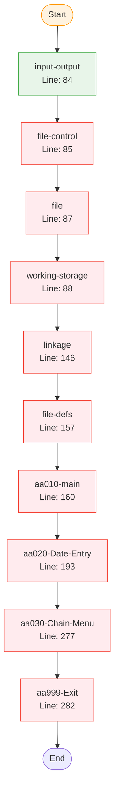
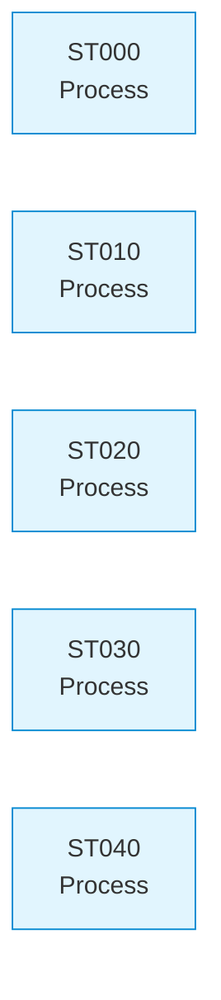
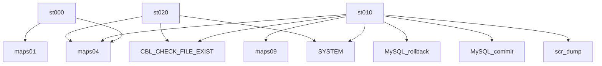

# Stock Control - System Visualizations

**Generated from Code**: 2025-09-15T16:57:46.774Z

## 1. System Context Diagram

```mermaid
graph TB
    %% Context Diagram - Generated from actual CALL analysis
    %% Subsystem: Stock_Control
    %% Internal Programs: 8
    %% External Dependencies: 10

    classDef internal fill:#e1f5e1,stroke:#4caf50,stroke-width:2px
    classDef external fill:#ffe0e0,stroke:#f44336,stroke-width:2px
    classDef subsystem fill:#e3f2fd,stroke:#2196f3,stroke-width:3px

    subgraph StockControl["Stock Control"]
        st000["ST000"]
        st010["ST010"]
        st020["ST020"]
        st030["ST030"]
        st040["ST040"]
        more["... and 3 more programs"]
    end

    maps01["maps01"]:::external
    maps04["maps04"]:::external
    CBLCHECKFILEEXIST["CBL_CHECK_FILE_EXIST"]:::external
    MySQLcommit["MySQL_commit"]:::external
    MySQLrollback["MySQL_rollback"]:::external
    SYSTEM["SYSTEM"]:::external
    maps09["maps09"]:::external
    scrdump["scr_dump"]:::external
    acas011["acas011"]:::external
    sl070["sl070"]:::external
    st000 --> maps04
    st000 --> maps01
    st010 --> CBLCHECKFILEEXIST
    st010 --> maps04
    st010 --> maps09
    st010 --> MySQLrollback
    st010 --> MySQLcommit
    st010 --> scrdump
    st010 --> SYSTEM
    st020 --> CBLCHECKFILEEXIST
    st020 --> SYSTEM
    st020 --> maps04
    st030 --> CBLCHECKFILEEXIST
    st030 --> SYSTEM
    st030 --> maps04
    st040 --> CBLCHECKFILEEXIST
    st060 --> acas011
    st060 --> maps04
    st060 --> CBLCHECKFILEEXIST
    stock --> CBLCHECKFILEEXIST

    class StockControl subsystem
    class st000 internal
    class st010 internal
    class st020 internal
    class st030 internal
    class st040 internal
```

**Evidence**: Generated from 23 actual CALL statements in code
**Confidence**: 1.0 (from parsed AST)

## 2. Program Flow Diagrams

### ST000 Flow

**Evidence**: From 10 sections, 0 PERFORM statements
**Warning**: 9 potentially dead code sections detected
### ST010 Flow

```mermaid
flowchart TD
    %% Program Flow - st010
    %% Generated from PERFORM/GOTO analysis
    %% Sections: 122, PERFORMs: 0

    classDef performed fill:#e8f5e9,stroke:#4caf50
    classDef dead fill:#ffebee,stroke:#f44336
    classDef entry fill:#fff3e0,stroke:#ff9800

    Start([Start]):::entry
    S0["input-output<br/>Line: 194"]:::performed
    S1["file-control<br/>Line: 197"]:::dead
    S2["file<br/>Line: 207"]:::dead
    S3["working-storage<br/>Line: 215"]:::dead
    S4["linkage<br/>Line: 496"]:::dead
    S5["screen<br/>Line: 505"]:::dead
    S6["file-defs<br/>Line: 628"]:::dead
    S7["aa000-Core<br/>Line: 631"]:::dead
    S8["aa010-Menu-Return<br/>Line: 652"]:::dead
    S9["aa020-Menu-Input<br/>Line: 656"]:::dead
    S10["maps04<br/>Line: 708"]:::dead
    S11["maps09<br/>Line: 711"]:::dead
    S12["end-if<br/>Line: 754"]:::dead
    S13["end-if<br/>Line: 769"]:::dead
    S14["end-if<br/>Line: 784"]:::dead
    S15["Clear-Error-Line<br/>Line: 787"]:::dead
    S16["aa999-Exit<br/>Line: 790"]:::dead
    S17["ba000-Setup-Stock<br/>Line: 793"]:::dead
    S18["end-if<br/>Line: 811"]:::dead
    S19["ba010-Display-Stock-Headings<br/>Line: 831"]:::dead
    S20["ba020-Stock-Item-Accept<br/>Line: 841"]:::dead
    S21["ba030-Stock-Abrev-Item-Accept<br/>Line: 850"]:::dead
    S22["ba040-Accept-Block<br/>Line: 891"]:::dead
    S23["ba042-Get-Stock-Retail<br/>Line: 975"]:::dead
    S24["ba044-Get-Stock-Cost<br/>Line: 981"]:::dead
    S25["ba046-Get-Stock-Value<br/>Line: 986"]:::dead
    S26["ba050-Main-Output<br/>Line: 1078"]:::dead
    S27["ba998-Main-End<br/>Line: 1101"]:::dead
    S28["ba999-Exit<br/>Line: 1106"]:::dead
    S29["exit<br/>Line: 1107"]:::dead
    S30["ca000-Amend-Stock<br/>Line: 1109"]:::dead
    S31["ca010-Display-Stock-Headings<br/>Line: 1134"]:::dead
    S32["ca020-Stock-Item-Accept<br/>Line: 1137"]:::dead
    S33["WS-Temp-Stock-Key<br/>Line: 1149"]:::dead
    S34["ca030-Get-Record<br/>Line: 1151"]:::dead
    S35["ca040-Accept-Block<br/>Line: 1183"]:::dead
    S36["ca042-Get-Stock-Retail<br/>Line: 1267"]:::dead
    S37["ca044-Get-Stock-Cost<br/>Line: 1273"]:::dead
    S38["ca046-Get-Stock-Value<br/>Line: 1278"]:::dead
    S39["ca050-Main-Output<br/>Line: 1366"]:::dead
    S40["ca998-Main-End<br/>Line: 1389"]:::dead
    S41["ca999-Exit<br/>Line: 1394"]:::dead
    S42["exit<br/>Line: 1395"]:::dead
    S43["da000-Delete-Stock<br/>Line: 1397"]:::dead
    S44["da010-Display-Stock-Headings<br/>Line: 1406"]:::dead
    S45["da020-Stock-Item-Accept<br/>Line: 1409"]:::dead
    S46["Customer-Code<br/>Line: 1412"]:::dead
    S47["WS-Temp-Stock-Key<br/>Line: 1425"]:::dead
    S48["da030-Get-Record<br/>Line: 1428"]:::dead
    S49["da040-Accept-Delete<br/>Line: 1485"]:::dead
    S50["da999-Exit<br/>Line: 1509"]:::dead
    S51["exit<br/>Line: 1510"]:::dead
    S52["ea000-Report-Stock<br/>Line: 1512"]:::dead
    S53["ea999-exit<br/>Line: 1529"]:::dead
    S54["exit<br/>Line: 1530"]:::dead
    S55["ea200-Produce-Report<br/>Line: 1532"]:::dead
    S56["ea210-Read-Stock<br/>Line: 1547"]:::dead
    S57["ea220-Heads<br/>Line: 1653"]:::dead
    S58["end-if<br/>Line: 1669"]:::dead
    S59["ea230-Totals<br/>Line: 1671"]:::dead
    S60["ea299-Exit<br/>Line: 1680"]:::dead
    S61["exit<br/>Line: 1682"]:::dead
    S62["fa000-Display-Stock<br/>Line: 1684"]:::dead
    S63["fa010-Display-Stock-Headings<br/>Line: 1695"]:::dead
    S64["fa020-Stock-Item-Accept<br/>Line: 1698"]:::dead
    S65["Customer-Code<br/>Line: 1701"]:::dead
    S66["WS-Temp-Stock-Key<br/>Line: 1722"]:::dead
    S67["fa030-Get-Record<br/>Line: 1724"]:::dead
    S68["fa999-Exit<br/>Line: 1789"]:::dead
    S69["exit<br/>Line: 1790"]:::dead
    S70["ga000-Renumber-Stock<br/>Line: 1792"]:::dead
    S71["ga010-Display-Stock-Headings<br/>Line: 1801"]:::dead
    S72["ga020-Stock-Item-Accept<br/>Line: 1804"]:::dead
    S73["Customer-Code<br/>Line: 1807"]:::dead
    S74["WS-Temp-Stock-Key<br/>Line: 1819"]:::dead
    S75["ga030-Get-Record<br/>Line: 1822"]:::dead
    S76["WS-Temp-Stock-Key<br/>Line: 1873"]:::dead
    S77["WS-Save-Abrev-Key<br/>Line: 1875"]:::dead
    S78["ga040-Accept-New-Stock-No<br/>Line: 1877"]:::dead
    S79["ga050-Accept-Renumber<br/>Line: 1913"]:::dead
    S80["ga999-Exit<br/>Line: 1952"]:::dead
    S81["exit<br/>Line: 1953"]:::dead
    S82["zz010-Display-Heading<br/>Line: 1959"]:::dead
    S83["zz010-Exit<br/>Line: 1984"]:::dead
    S84["exit<br/>Line: 1985"]:::dead
    S85["zz020-Convert-Date<br/>Line: 1987"]:::dead
    S86["end-if<br/>Line: 2006"]:::dead
    S87["zz020-exit<br/>Line: 2008"]:::dead
    S88["exit<br/>Line: 2009"]:::dead
    S89["zz020-Display-Outline<br/>Line: 2011"]:::dead
    S90["zz020-exit<br/>Line: 2022"]:::dead
    S91["exit<br/>Line: 2023"]:::dead
    S92["zz030-common-routines<br/>Line: 2025"]:::dead
    S93["zz030-exit<br/>Line: 2061"]:::dead
    S94["exit<br/>Line: 2062"]:::dead
    S95["zz040-Check-for-Supplier<br/>Line: 2064"]:::dead
    S96["WS-File-Key<br/>Line: 2082"]:::dead
    S97["zz040-Exit<br/>Line: 2090"]:::dead
    S98["exit<br/>Line: 2091"]:::dead
    S99["zz050-Validate-Date<br/>Line: 2093"]:::dead
    S100["zz050-test-date<br/>Line: 2120"]:::dead
    S101["zz050-exit<br/>Line: 2125"]:::dead
    S102["exit<br/>Line: 2126"]:::dead
    S103["zz060-Convert-Date<br/>Line: 2128"]:::dead
    S104["zz060-Exit<br/>Line: 2160"]:::dead
    S105["exit<br/>Line: 2161"]:::dead
    S106["zz070-Initialize-Stock-Record<br/>Line: 2163"]:::dead
    S107["Stock-Services-Flag<br/>Line: 2178"]:::dead
    S108["Stock-Wip-Deds<br/>Line: 2198"]:::dead
    S109["end-perform<br/>Line: 2205"]:::dead
    S110["zz070-Exit<br/>Line: 2207"]:::dead
    S111["exit<br/>Line: 2208"]:::dead
    S112["zz080-Copy-To-SS<br/>Line: 2210"]:::dead
    S113["zz080-Exit<br/>Line: 2226"]:::dead
    S114["exit<br/>Line: 2227"]:::dead
    S115["zz090-Copy-From-SS<br/>Line: 2229"]:::dead
    S116["zz090-Exit<br/>Line: 2245"]:::dead
    S117["exit<br/>Line: 2246"]:::dead
    S118["zz100-test-escape<br/>Line: 2248"]:::dead
    S119["zz100-get-escape<br/>Line: 2253"]:::dead
    S120["zz100-exit<br/>Line: 2261"]:::dead
    S121["exit<br/>Line: 2262"]:::dead
    Start --> S0
    S0 --> S1
    S1 --> S2
    S2 --> S3
    S3 --> S4
    S4 --> S5
    S5 --> S6
    S6 --> S7
    S7 --> S8
    S8 --> S9
    S9 --> S10
    S10 --> S11
    S11 --> S12
    S12 --> S13
    S13 --> S14
    S14 --> S15
    S15 --> S16
    S16 --> S17
    S17 --> S18
    S18 --> S19
    S19 --> S20
    S20 --> S21
    S21 --> S22
    S22 --> S23
    S23 --> S24
    S24 --> S25
    S25 --> S26
    S26 --> S27
    S27 --> S28
    S28 --> S29
    S29 --> S30
    S30 --> S31
    S31 --> S32
    S32 --> S33
    S33 --> S34
    S34 --> S35
    S35 --> S36
    S36 --> S37
    S37 --> S38
    S38 --> S39
    S39 --> S40
    S40 --> S41
    S41 --> S42
    S42 --> S43
    S43 --> S44
    S44 --> S45
    S45 --> S46
    S46 --> S47
    S47 --> S48
    S48 --> S49
    S49 --> S50
    S50 --> S51
    S51 --> S52
    S52 --> S53
    S53 --> S54
    S54 --> S55
    S55 --> S56
    S56 --> S57
    S57 --> S58
    S58 --> S59
    S59 --> S60
    S60 --> S61
    S61 --> S62
    S62 --> S63
    S63 --> S64
    S64 --> S65
    S65 --> S66
    S66 --> S67
    S67 --> S68
    S68 --> S69
    S69 --> S70
    S70 --> S71
    S71 --> S72
    S72 --> S73
    S73 --> S74
    S74 --> S75
    S75 --> S76
    S76 --> S77
    S77 --> S78
    S78 --> S79
    S79 --> S80
    S80 --> S81
    S81 --> S82
    S82 --> S83
    S83 --> S84
    S84 --> S85
    S85 --> S86
    S86 --> S87
    S87 --> S88
    S88 --> S89
    S89 --> S90
    S90 --> S91
    S91 --> S92
    S92 --> S93
    S93 --> S94
    S94 --> S95
    S95 --> S96
    S96 --> S97
    S97 --> S98
    S98 --> S99
    S99 --> S100
    S100 --> S101
    S101 --> S102
    S102 --> S103
    S103 --> S104
    S104 --> S105
    S105 --> S106
    S106 --> S107
    S107 --> S108
    S108 --> S109
    S109 --> S110
    S110 --> S111
    S111 --> S112
    S112 --> S113
    S113 --> S114
    S114 --> S115
    S115 --> S116
    S116 --> S117
    S117 --> S118
    S118 --> S119
    S119 --> S120
    S120 --> S121
    S121 --> End([End])
```

**Evidence**: From 122 sections, 0 PERFORM statements
**Warning**: 121 potentially dead code sections detected
## 3. Data Flow Diagram

**Evidence**: Generated from 0 file operations in code
**Files**: 0 data files accessed
## 4. Call Hierarchy

**Evidence**: 23 CALL relationships analyzed
**Root Programs**: st000, st010, st020

## Diagram Validation

- ✅ All diagrams generated from actual code analysis
- ✅ Source programs and line numbers traceable
- ✅ "Generated from code" watermark included
- ✅ No assumptions - only documented relationships
