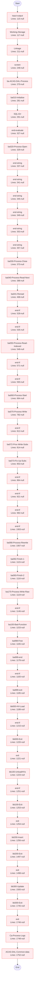

```mermaid
flowchart TD
    %% Control Flow - irsnominalMT
    %% McCabe Complexity: 34
    %% Sections: 58, PERFORMs: 0

    Start([Start])
    S0["input-output<br/>Lines: 115-null"]:::dead
    S1["Working-Storage<br/>Lines: 117-null"]:::dead
    S2["Linkage<br/>Lines: 211-null"]:::dead
    S3["screen<br/>Lines: 248-null"]:::dead
    S4["ba-ACAS-DAL-Process<br/>Lines: 270-null"]:::dead
    S5["ba010-Initialise<br/>Lines: 281-null"]:::dead
    S6["SQL-Err<br/>Lines: 291-null"]:::dead
    S7["end-evaluate<br/>Lines: 327-null"]:::dead
    S8["ba020-Process-Open<br/>Lines: 329-null"]:::dead
    S9["end-string<br/>Lines: 337-null"]:::dead
    S10["end-string<br/>Lines: 341-null"]:::dead
    S11["end-string<br/>Lines: 345-null"]:::dead
    S12["end-string<br/>Lines: 349-null"]:::dead
    S13["end-string<br/>Lines: 353-null"]:::dead
    S14["end-string<br/>Lines: 357-null"]:::dead
    S15["ba030-Process-Close<br/>Lines: 373-null"]:::dead
    S16["ba040-Process-Read-Next<br/>Lines: 388-null"]:::dead
    S17["ba041-Reread<br/>Lines: 468-null"]:::dead
    S18["end-if<br/>Lines: 528-null"]:::dead
    S19["end-if<br/>Lines: 535-null"]:::dead
    S20["ba050-Process-Read-Indexed<br/>Lines: 548-null"]:::dead
    S21["end-if<br/>Lines: 571-null"]:::dead
    S22["end-if<br/>Lines: 593-null"]:::dead
    S23["ba060-Process-Start<br/>Lines: 664-null"]:::dead
    S24["ba070-Process-Write<br/>Lines: 782-null"]:::dead
    S25["end-if<br/>Lines: 812-null"]:::dead
    S26["ba072-Proc-Write-Subs<br/>Lines: 814-null"]:::dead
    S27["ba073-Fix-Up-Subs<br/>Lines: 853-null"]:::dead
    S28["end-if<br/>Lines: 864-null"]:::dead
    S29["end-if<br/>Lines: 921-null"]:::dead
    S30["end-if<br/>Lines: 982-null"]:::dead
    S31["end-if<br/>Lines: 1063-null"]:::dead
    S32["ba090-Process-Rewrite<br/>Lines: 1067-null"]:::dead
    S33["ba092-Finish-1<br/>Lines: 1115-null"]:::dead
    S34["ba093-Finish-2<br/>Lines: 1116-null"]:::dead
    S35["ba170-Process-Write-Raw<br/>Lines: 1119-null"]:::dead
    S36["end-if<br/>Lines: 1146-null"]:::dead
    S37["ba100-Bad-Function<br/>Lines: 1153-null"]:::dead
    S38["ba998-Free<br/>Lines: 1165-null"]:::dead
    S39["ba999-end<br/>Lines: 1178-null"]:::dead
    S40["end-if<br/>Lines: 1183-null"]:::dead
    S41["ba999-exit<br/>Lines: 1185-null"]:::dead
    S42["bb000-HV-Load<br/>Lines: 1188-null"]:::dead
    S43["end-if<br/>Lines: 1215-null"]:::dead
    S44["bb000-Exit<br/>Lines: 1220-null"]:::dead
    S45["exit<br/>Lines: 1221-null"]:::dead
    S46["bb100-UnloadHVs<br/>Lines: 1223-null"]:::dead
    S47["end-if<br/>Lines: 1251-null"]:::dead
    S48["bb100-Exit<br/>Lines: 1253-null"]:::dead
    S49["exit<br/>Lines: 1254-null"]:::dead
    S50["bb200-Insert<br/>Lines: 1256-null"]:::dead
    S51["bb200-Exit<br/>Lines: 1497-null"]:::dead
    S52["exit<br/>Lines: 1498-null"]:::dead
    S53["bb300-Update<br/>Lines: 1500-null"]:::dead
    S54["bb300-Exit<br/>Lines: 1745-null"]:::dead
    S55["exit<br/>Lines: 1746-null"]:::dead
    S56["Ca-Process-Logs<br/>Lines: 1748-null"]:::dead
    S57["ACAS-DAL-Common-data<br/>Lines: 1752-null"]:::dead
    Start --> S0
    S0 --> S1
    S1 --> S2
    S2 --> S3
    S3 --> S4
    S4 --> S5
    S5 --> S6
    S6 --> S7
    S7 --> S8
    S8 --> S9
    S9 --> S10
    S10 --> S11
    S11 --> S12
    S12 --> S13
    S13 --> S14
    S14 --> S15
    S15 --> S16
    S16 --> S17
    S17 --> S18
    S18 --> S19
    S19 --> S20
    S20 --> S21
    S21 --> S22
    S22 --> S23
    S23 --> S24
    S24 --> S25
    S25 --> S26
    S26 --> S27
    S27 --> S28
    S28 --> S29
    S29 --> S30
    S30 --> S31
    S31 --> S32
    S32 --> S33
    S33 --> S34
    S34 --> S35
    S35 --> S36
    S36 --> S37
    S37 --> S38
    S38 --> S39
    S39 --> S40
    S40 --> S41
    S41 --> S42
    S42 --> S43
    S43 --> S44
    S44 --> S45
    S45 --> S46
    S46 --> S47
    S47 --> S48
    S48 --> S49
    S49 --> S50
    S50 --> S51
    S51 --> S52
    S52 --> S53
    S53 --> S54
    S54 --> S55
    S55 --> S56
    S56 --> S57
    S57 --> End([End])

    classDef dead fill:#ffebee,stroke:#f44336
```

**Complexity Analysis:**
- Total Business Rules: 4
- IF Statements: 0
- Complex Conditions: 0
- Decision Logic: 4

**Warning:** 57 potentially dead sections detected
