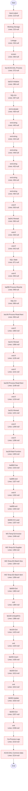

```mermaid
flowchart TD
    %% Control Flow - otm5MT
    %% McCabe Complexity: 35
    %% Sections: 55, PERFORMs: 0

    Start([Start])
    S0["input-output<br/>Lines: 213-null"]:::dead
    S1["Working-Storage<br/>Lines: 215-null"]:::dead
    S2["Linkage<br/>Lines: 334-null"]:::dead
    S3["screen<br/>Lines: 350-null"]:::dead
    S4["ba-ACAS-DAL-Process<br/>Lines: 372-null"]:::dead
    S5["ba010-Initialise<br/>Lines: 386-null"]:::dead
    S6["SQL-Err<br/>Lines: 397-null"]:::dead
    S7["end-evaluate<br/>Lines: 430-null"]:::dead
    S8["end-string<br/>Lines: 440-null"]:::dead
    S9["end-string<br/>Lines: 444-null"]:::dead
    S10["end-string<br/>Lines: 448-null"]:::dead
    S11["end-string<br/>Lines: 452-null"]:::dead
    S12["end-string<br/>Lines: 456-null"]:::dead
    S13["end-string<br/>Lines: 460-null"]:::dead
    S14["end-if<br/>Lines: 563-null"]:::dead
    S15["ba041-Reread<br/>Lines: 565-null"]:::dead
    S16["end-if<br/>Lines: 636-null"]:::dead
    S17["end-if<br/>Lines: 642-null"]:::dead
    S18["SQL-State<br/>Lines: 871-null"]:::dead
    S19["end-if<br/>Lines: 945-null"]:::dead
    S20["ba090-Process-Rewrite<br/>Lines: 948-null"]:::dead
    S21["SQL-Err<br/>Lines: 989-null"]:::dead
    S22["ba140-Process-Read-Next<br/>Lines: 993-null"]:::dead
    S23["end-if<br/>Lines: 1064-null"]:::dead
    S24["ba141-Reread<br/>Lines: 1066-null"]:::dead
    S25["end-if<br/>Lines: 1135-null"]:::dead
    S26["end-if<br/>Lines: 1141-null"]:::dead
    S27["ba150-Process-Read-Next<br/>Lines: 1148-null"]:::dead
    S28["end-if<br/>Lines: 1219-null"]:::dead
    S29["ba151-Reread<br/>Lines: 1221-null"]:::dead
    S30["end-if<br/>Lines: 1290-null"]:::dead
    S31["end-if<br/>Lines: 1296-null"]:::dead
    S32["ba100-Bad-Function<br/>Lines: 1303-null"]:::dead
    S33["ba998-Free<br/>Lines: 1315-null"]:::dead
    S34["ba999-end<br/>Lines: 1327-null"]:::dead
    S35["end-if<br/>Lines: 1332-null"]:::dead
    S36["ba999-exit<br/>Lines: 1334-null"]:::dead
    S37["bb000-HV-Load<br/>Lines: 1337-null"]:::dead
    S38["WS-Temp-Ed-Invoice<br/>Lines: 1348-null"]:::dead
    S39["WS-Temp-Ed-Supplier<br/>Lines: 1350-null"]:::dead
    S40["WS-Temp-ED-Batch-Nos<br/>Lines: 1354-null"]:::dead
    S41["WS-Temp-ED-Batch-Item<br/>Lines: 1356-null"]:::dead
    S42["bb000-Exit<br/>Lines: 1383-null"]:::dead
    S43["exit<br/>Lines: 1384-null"]:::dead
    S44["bb100-UnloadHVs<br/>Lines: 1386-null"]:::dead
    S45["bb100-Exit<br/>Lines: 1423-null"]:::dead
    S46["exit<br/>Lines: 1424-null"]:::dead
    S47["bb200-Insert<br/>Lines: 1426-null"]:::dead
    S48["bb200-Exit<br/>Lines: 1813-null"]:::dead
    S49["exit<br/>Lines: 1814-null"]:::dead
    S50["bb300-Update<br/>Lines: 1816-null"]:::dead
    S51["bb300-Exit<br/>Lines: 2207-null"]:::dead
    S52["exit<br/>Lines: 2208-null"]:::dead
    S53["Ca-Process-Logs<br/>Lines: 2210-null"]:::dead
    S54["ACAS-DAL-Common-data<br/>Lines: 2214-null"]:::dead
    Start --> S0
    S0 --> S1
    S1 --> S2
    S2 --> S3
    S3 --> S4
    S4 --> S5
    S5 --> S6
    S6 --> S7
    S7 --> S8
    S8 --> S9
    S9 --> S10
    S10 --> S11
    S11 --> S12
    S12 --> S13
    S13 --> S14
    S14 --> S15
    S15 --> S16
    S16 --> S17
    S17 --> S18
    S18 --> S19
    S19 --> S20
    S20 --> S21
    S21 --> S22
    S22 --> S23
    S23 --> S24
    S24 --> S25
    S25 --> S26
    S26 --> S27
    S27 --> S28
    S28 --> S29
    S29 --> S30
    S30 --> S31
    S31 --> S32
    S32 --> S33
    S33 --> S34
    S34 --> S35
    S35 --> S36
    S36 --> S37
    S37 --> S38
    S38 --> S39
    S39 --> S40
    S40 --> S41
    S41 --> S42
    S42 --> S43
    S43 --> S44
    S44 --> S45
    S45 --> S46
    S46 --> S47
    S47 --> S48
    S48 --> S49
    S49 --> S50
    S50 --> S51
    S51 --> S52
    S52 --> S53
    S53 --> S54
    S54 --> End([End])

    classDef dead fill:#ffebee,stroke:#f44336
```

**Complexity Analysis:**
- Total Business Rules: 5
- IF Statements: 0
- Complex Conditions: 0
- Decision Logic: 5

**Warning:** 54 potentially dead sections detected
