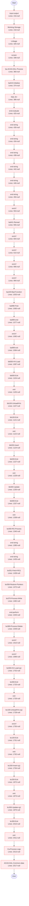

```mermaid
flowchart TD
    %% Control Flow - paymentsMT
    %% McCabe Complexity: 36
    %% Sections: 62, PERFORMs: 0

    Start([Start])
    S0["input-output<br/>Lines: 216-null"]:::dead
    S1["Working-Storage<br/>Lines: 218-null"]:::dead
    S2["Linkage<br/>Lines: 326-null"]:::dead
    S3["screen<br/>Lines: 338-null"]:::dead
    S4["ba-ACAS-DAL-Process<br/>Lines: 360-null"]:::dead
    S5["ba010-Initialise<br/>Lines: 374-null"]:::dead
    S6["SQL-Err<br/>Lines: 386-null"]:::dead
    S7["end-evaluate<br/>Lines: 420-null"]:::dead
    S8["end-string<br/>Lines: 430-null"]:::dead
    S9["end-string<br/>Lines: 434-null"]:::dead
    S10["end-string<br/>Lines: 438-null"]:::dead
    S11["end-string<br/>Lines: 442-null"]:::dead
    S12["end-string<br/>Lines: 446-null"]:::dead
    S13["end-string<br/>Lines: 450-null"]:::dead
    S14["end-if<br/>Lines: 553-null"]:::dead
    S15["ba041-Reread<br/>Lines: 555-null"]:::dead
    S16["end-if<br/>Lines: 604-null"]:::dead
    S17["end-if<br/>Lines: 610-null"]:::dead
    S18["end-if<br/>Lines: 906-null"]:::dead
    S19["end-if<br/>Lines: 994-null"]:::dead
    S20["ba100-Bad-Function<br/>Lines: 1053-null"]:::dead
    S21["ba998-Free<br/>Lines: 1065-null"]:::dead
    S22["ba999-end<br/>Lines: 1077-null"]:::dead
    S23["end-if<br/>Lines: 1082-null"]:::dead
    S24["ba999-exit<br/>Lines: 1084-null"]:::dead
    S25["bb000-HV-Load<br/>Lines: 1087-null"]:::dead
    S26["bb000-Exit<br/>Lines: 1104-null"]:::dead
    S27["exit<br/>Lines: 1105-null"]:::dead
    S28["bb100-UnloadHVs<br/>Lines: 1107-null"]:::dead
    S29["bb100-Exit<br/>Lines: 1121-null"]:::dead
    S30["exit<br/>Lines: 1122-null"]:::dead
    S31["bb200-Insert<br/>Lines: 1124-null"]:::dead
    S32["bb200-Exit<br/>Lines: 1227-null"]:::dead
    S33["exit<br/>Lines: 1228-null"]:::dead
    S34["bb300-Update<br/>Lines: 1230-null"]:::dead
    S35["bb300-Exit<br/>Lines: 1337-null"]:::dead
    S36["exit<br/>Lines: 1338-null"]:::dead
    S37["bc000-RG-Process<br/>Lines: 1340-null"]:::dead
    S38["end-string<br/>Lines: 1385-null"]:::dead
    S39["end-string<br/>Lines: 1435-null"]:::dead
    S40["bc051-Fetch-RG1<br/>Lines: 1438-null"]:::dead
    S41["bc058-Restore-Pointers<br/>Lines: 1472-null"]:::dead
    S42["bc070-Process-Write<br/>Lines: 1482-null"]:::dead
    S43["end-perform<br/>Lines: 1545-null"]:::dead
    S44["bc080-Process-Delete<br/>Lines: 1549-null"]:::dead
    S45["end-if<br/>Lines: 1610-null"]:::dead
    S46["end-if<br/>Lines: 1696-null"]:::dead
    S47["bc000-HV-Load-rg1<br/>Lines: 1702-null"]:::dead
    S48["bc000-Exit<br/>Lines: 1725-null"]:::dead
    S49["exit<br/>Lines: 1726-null"]:::dead
    S50["bc100-UnloadHVs-rg1<br/>Lines: 1728-null"]:::dead
    S51["end-if<br/>Lines: 1750-null"]:::dead
    S52["bc100-Exit<br/>Lines: 1761-null"]:::dead
    S53["exit<br/>Lines: 1762-null"]:::dead
    S54["bc200-Insert-rg1<br/>Lines: 1764-null"]:::dead
    S55["bc200-Exit<br/>Lines: 1872-null"]:::dead
    S56["exit<br/>Lines: 1873-null"]:::dead
    S57["bc300-Update-rg1<br/>Lines: 1875-null"]:::dead
    S58["bc300-Exit<br/>Lines: 2010-null"]:::dead
    S59["exit<br/>Lines: 2011-null"]:::dead
    S60["Ca-Process-Logs<br/>Lines: 2013-null"]:::dead
    S61["ACAS-DAL-Common-data<br/>Lines: 2017-null"]:::dead
    Start --> S0
    S0 --> S1
    S1 --> S2
    S2 --> S3
    S3 --> S4
    S4 --> S5
    S5 --> S6
    S6 --> S7
    S7 --> S8
    S8 --> S9
    S9 --> S10
    S10 --> S11
    S11 --> S12
    S12 --> S13
    S13 --> S14
    S14 --> S15
    S15 --> S16
    S16 --> S17
    S17 --> S18
    S18 --> S19
    S19 --> S20
    S20 --> S21
    S21 --> S22
    S22 --> S23
    S23 --> S24
    S24 --> S25
    S25 --> S26
    S26 --> S27
    S27 --> S28
    S28 --> S29
    S29 --> S30
    S30 --> S31
    S31 --> S32
    S32 --> S33
    S33 --> S34
    S34 --> S35
    S35 --> S36
    S36 --> S37
    S37 --> S38
    S38 --> S39
    S39 --> S40
    S40 --> S41
    S41 --> S42
    S42 --> S43
    S43 --> S44
    S44 --> S45
    S45 --> S46
    S46 --> S47
    S47 --> S48
    S48 --> S49
    S49 --> S50
    S50 --> S51
    S51 --> S52
    S52 --> S53
    S53 --> S54
    S54 --> S55
    S55 --> S56
    S56 --> S57
    S57 --> S58
    S58 --> S59
    S59 --> S60
    S60 --> S61
    S61 --> End([End])

    classDef dead fill:#ffebee,stroke:#f44336
```

**Complexity Analysis:**
- Total Business Rules: 3
- IF Statements: 0
- Complex Conditions: 0
- Decision Logic: 3

**Warning:** 61 potentially dead sections detected
