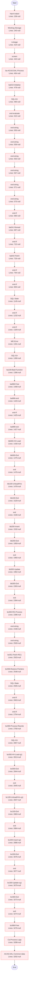

```mermaid
flowchart TD
    %% Control Flow - slautogenMT
    %% McCabe Complexity: 45
    %% Sections: 67, PERFORMs: 0

    Start([Start])
    S0["input-output<br/>Lines: 238-null"]:::dead
    S1["Working-Storage<br/>Lines: 240-null"]:::dead
    S2["Linkage<br/>Lines: 424-null"]:::dead
    S3["screen<br/>Lines: 442-null"]:::dead
    S4["ba-ACAS-DAL-Process<br/>Lines: 464-null"]:::dead
    S5["ba010-Initialise<br/>Lines: 478-null"]:::dead
    S6["SQL-Err<br/>Lines: 490-null"]:::dead
    S7["end-evaluate<br/>Lines: 522-null"]:::dead
    S8["end-string<br/>Lines: 555-null"]:::dead
    S9["end-string<br/>Lines: 559-null"]:::dead
    S10["end-string<br/>Lines: 563-null"]:::dead
    S11["end-string<br/>Lines: 567-null"]:::dead
    S12["end-string<br/>Lines: 571-null"]:::dead
    S13["end-string<br/>Lines: 575-null"]:::dead
    S14["end-if<br/>Lines: 685-null"]:::dead
    S15["ba041-Reread<br/>Lines: 687-null"]:::dead
    S16["end-if<br/>Lines: 722-null"]:::dead
    S17["ba042-Fetch<br/>Lines: 726-null"]:::dead
    S18["end-if<br/>Lines: 794-null"]:::dead
    S19["end-if<br/>Lines: 800-null"]:::dead
    S20["SQL-State<br/>Lines: 1145-null"]:::dead
    S21["end-if<br/>Lines: 1232-null"]:::dead
    S22["end-if<br/>Lines: 1329-null"]:::dead
    S23["WE-Error<br/>Lines: 1331-null"]:::dead
    S24["SQL-Err<br/>Lines: 1390-null"]:::dead
    S25["ba100-Bad-Function<br/>Lines: 1396-null"]:::dead
    S26["ba998-Free<br/>Lines: 1408-null"]:::dead
    S27["ba999-end<br/>Lines: 1420-null"]:::dead
    S28["end-if<br/>Lines: 1425-null"]:::dead
    S29["ba999-exit<br/>Lines: 1427-null"]:::dead
    S30["bb000-HV-Load<br/>Lines: 1430-null"]:::dead
    S31["bb000-Exit<br/>Lines: 1475-null"]:::dead
    S32["exit<br/>Lines: 1476-null"]:::dead
    S33["bb100-UnloadHVs<br/>Lines: 1478-null"]:::dead
    S34["bb100-Exit<br/>Lines: 1529-null"]:::dead
    S35["exit<br/>Lines: 1530-null"]:::dead
    S36["bb200-Insert<br/>Lines: 1532-null"]:::dead
    S37["bb200-Exit<br/>Lines: 1959-null"]:::dead
    S38["exit<br/>Lines: 1960-null"]:::dead
    S39["bb300-Update<br/>Lines: 1962-null"]:::dead
    S40["bb300-Exit<br/>Lines: 2393-null"]:::dead
    S41["exit<br/>Lines: 2394-null"]:::dead
    S42["bc000-RG-Process<br/>Lines: 2396-null"]:::dead
    S43["end-string<br/>Lines: 2448-null"]:::dead
    S44["end-string<br/>Lines: 2500-null"]:::dead
    S45["bc051-Fetch-RG1<br/>Lines: 2503-null"]:::dead
    S46["bc058-Restore-Pointers<br/>Lines: 2548-null"]:::dead
    S47["SQL-State<br/>Lines: 2565-null"]:::dead
    S48["end-if<br/>Lines: 2663-null"]:::dead
    S49["end-if<br/>Lines: 2754-null"]:::dead
    S50["bc090-Process-Rewrite<br/>Lines: 2760-null"]:::dead
    S51["SQL-Err<br/>Lines: 2807-null"]:::dead
    S52["bc000-HV-Load-rg1<br/>Lines: 2813-null"]:::dead
    S53["bc000-Exit<br/>Lines: 2844-null"]:::dead
    S54["exit<br/>Lines: 2845-null"]:::dead
    S55["bc100-UnloadHVs-rg1<br/>Lines: 2847-null"]:::dead
    S56["bc100-Exit<br/>Lines: 2883-null"]:::dead
    S57["exit<br/>Lines: 2884-null"]:::dead
    S58["bc200-Insert-rg1<br/>Lines: 2886-null"]:::dead
    S59["bc200-Exit<br/>Lines: 3076-null"]:::dead
    S60["exit<br/>Lines: 3077-null"]:::dead
    S61["bc300-Update-rg1<br/>Lines: 3079-null"]:::dead
    S62["bc300-Exit<br/>Lines: 3273-null"]:::dead
    S63["exit<br/>Lines: 3274-null"]:::dead
    S64["bc998-Free<br/>Lines: 3276-null"]:::dead
    S65["Ca-Process-Logs<br/>Lines: 3288-null"]:::dead
    S66["ACAS-DAL-Common-data<br/>Lines: 3292-null"]:::dead
    Start --> S0
    S0 --> S1
    S1 --> S2
    S2 --> S3
    S3 --> S4
    S4 --> S5
    S5 --> S6
    S6 --> S7
    S7 --> S8
    S8 --> S9
    S9 --> S10
    S10 --> S11
    S11 --> S12
    S12 --> S13
    S13 --> S14
    S14 --> S15
    S15 --> S16
    S16 --> S17
    S17 --> S18
    S18 --> S19
    S19 --> S20
    S20 --> S21
    S21 --> S22
    S22 --> S23
    S23 --> S24
    S24 --> S25
    S25 --> S26
    S26 --> S27
    S27 --> S28
    S28 --> S29
    S29 --> S30
    S30 --> S31
    S31 --> S32
    S32 --> S33
    S33 --> S34
    S34 --> S35
    S35 --> S36
    S36 --> S37
    S37 --> S38
    S38 --> S39
    S39 --> S40
    S40 --> S41
    S41 --> S42
    S42 --> S43
    S43 --> S44
    S44 --> S45
    S45 --> S46
    S46 --> S47
    S47 --> S48
    S48 --> S49
    S49 --> S50
    S50 --> S51
    S51 --> S52
    S52 --> S53
    S53 --> S54
    S54 --> S55
    S55 --> S56
    S56 --> S57
    S57 --> S58
    S58 --> S59
    S59 --> S60
    S60 --> S61
    S61 --> S62
    S62 --> S63
    S63 --> S64
    S64 --> S65
    S65 --> S66
    S66 --> End([End])

    classDef dead fill:#ffebee,stroke:#f44336
```

**Complexity Analysis:**
- Total Business Rules: 7
- IF Statements: 0
- Complex Conditions: 0
- Decision Logic: 7

**Warning:** 66 potentially dead sections detected
