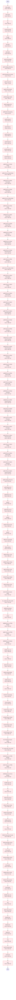

```mermaid
flowchart TD
    %% Control Flow - xl150
    %% McCabe Complexity: 33
    %% Sections: 121, PERFORMs: 0

    Start([Start])
    S0["input-output<br/>Lines: 333-null"]:::dead
    S1["file-control<br/>Lines: 336-null"]:::dead
    S2["file<br/>Lines: 356-null"]:::dead
    S3["working-storage<br/>Lines: 390-null"]:::dead
    S4["linkage<br/>Lines: 589-null"]:::dead
    S5["File-Defs<br/>Lines: 603-null"]:::dead
    S6["aa00-Main<br/>Lines: 605-null"]:::dead
    S7["aa010-Acpt-Reply<br/>Lines: 646-null"]:::dead
    S8["aa012-Display-Warnings<br/>Lines: 662-null"]:::dead
    S9["aa015-Recheck-for-Issues<br/>Lines: 679-null"]:::dead
    S10["aa024-Test-EoC<br/>Lines: 771-null"]:::dead
    S11["aa025-OTM-Checks<br/>Lines: 776-null"]:::dead
    S12["aa030-Display-Heads<br/>Lines: 798-null"]:::dead
    S13["aa040-Display-End<br/>Lines: 805-null"]:::dead
    S14["aa050-EOY-Processing<br/>Lines: 814-null"]:::dead
    S15["aa100-Phase-6<br/>Lines: 829-null"]:::dead
    S16["aa110-Phase-7<br/>Lines: 911-null"]:::dead
    S17["aa120-Phase-8<br/>Lines: 985-null"]:::dead
    S18["aa130-Phase-9<br/>Lines: 1062-null"]:::dead
    S19["aa140-Phase-10<br/>Lines: 1141-null"]:::dead
    S20["aa150-Phase-11<br/>Lines: 1215-null"]:::dead
    S21["aa800-Error-on-Read-OTM3<br/>Lines: 1296-null"]:::dead
    S22["aa801-Error-on-Read-Sales<br/>Lines: 1300-null"]:::dead
    S23["aa802-Error-on-Write-Temp-Sales<br/>Lines: 1305-null"]:::dead
    S24["aa803-Error-on-Read-Temp-Sales<br/>Lines: 1310-null"]:::dead
    S25["aa804-Error-on-Write-Sales<br/>Lines: 1315-null"]:::dead
    S26["aa805-Error-On-Write-OTM3<br/>Lines: 1320-null"]:::dead
    S27["aa806-Error-on-Write-Temp-OTM3<br/>Lines: 1325-null"]:::dead
    S28["aa807-Error-on-Read-Temp-OTM3<br/>Lines: 1330-null"]:::dead
    S29["aa808-Error-on-Read-SInvoices<br/>Lines: 1335-null"]:::dead
    S30["aa809-Error-on-Write-Temp-SInvoices<br/>Lines: 1340-null"]:::dead
    S31["aa810-Error-on-Read-Temp-SInvoices<br/>Lines: 1345-null"]:::dead
    S32["aa811-Error-on-Write-SInvoices<br/>Lines: 1350-null"]:::dead
    S33["aa812-Error-on-Open-Sales<br/>Lines: 1355-null"]:::dead
    S34["aa813-Error-on-Open-Temp-Sales<br/>Lines: 1360-null"]:::dead
    S35["aa814-Error-on-Open-OTM3<br/>Lines: 1365-null"]:::dead
    S36["aa815-Error-on-Open-Temp-OTM3<br/>Lines: 1370-null"]:::dead
    S37["aa816-Error-on-Open-SInvoices<br/>Lines: 1375-null"]:::dead
    S38["aa817-Error-on-Open-Temp-SInvoices<br/>Lines: 1380-null"]:::dead
    S39["aa900-Error-on-Read-OTM5<br/>Lines: 1388-null"]:::dead
    S40["aa901-Error-on-Read-Purchase<br/>Lines: 1392-null"]:::dead
    S41["aa902-Error-on-Write-Temp-Purchase<br/>Lines: 1397-null"]:::dead
    S42["aa903-Error-on-Read-Temp-Purchase<br/>Lines: 1402-null"]:::dead
    S43["aa904-Error-on-Write-Purchase<br/>Lines: 1407-null"]:::dead
    S44["aa905-Error-On-Write-OTM5<br/>Lines: 1412-null"]:::dead
    S45["aa906-Error-on-Write-Temp-OTM5<br/>Lines: 1417-null"]:::dead
    S46["aa907-Error-on-Read-Temp-OTM5<br/>Lines: 1422-null"]:::dead
    S47["aa908-Error-on-Read-PInvoices<br/>Lines: 1427-null"]:::dead
    S48["aa909-Error-on-Write-Temp-PInvoices<br/>Lines: 1432-null"]:::dead
    S49["aa910-Error-on-Read-Temp-PInvoices<br/>Lines: 1437-null"]:::dead
    S50["aa911-Error-on-Write-PInvoices<br/>Lines: 1442-null"]:::dead
    S51["aa912-Error-on-Open-Purchase<br/>Lines: 1447-null"]:::dead
    S52["aa913-Error-on-Open-Temp-Purchase<br/>Lines: 1452-null"]:::dead
    S53["aa914-Error-on-Open-OTM5<br/>Lines: 1457-null"]:::dead
    S54["aa915-Error-on-Open-Temp-OTM5<br/>Lines: 1462-null"]:::dead
    S55["aa916-Error-on-Open-PInvoices<br/>Lines: 1467-null"]:::dead
    S56["aa917-Error-on-Open-Temp-PInvoices<br/>Lines: 1472-null"]:::dead
    S57["aa950-Display-File-Error<br/>Lines: 1478-null"]:::dead
    S58["aa970-Menu-Exit<br/>Lines: 1490-null"]:::dead
    S59["aa980-Menu-Exit<br/>Lines: 1501-null"]:::dead
    S60["goback<br/>Lines: 1502-null"]:::dead
    S61["aa990-Menu-Error<br/>Lines: 1504-null"]:::dead
    S62["goback<br/>Lines: 1506-null"]:::dead
    S63["aa991-File-Error-Exit<br/>Lines: 1509-null"]:::dead
    S64["goback<br/>Lines: 1511-null"]:::dead
    S65["AB00-SL-Processing<br/>Lines: 1525-null"]:::dead
    S66["Sales-Activety<br/>Lines: 1573-null"]:::dead
    S67["AB020-Phase-1-End<br/>Lines: 1580-null"]:::dead
    S68["AB060-Phase-2-Read<br/>Lines: 1590-null"]:::dead
    S69["AB070-Phase-2-End<br/>Lines: 1624-null"]:::dead
    S70["AB100-Phase-3-Begin<br/>Lines: 1628-null"]:::dead
    S71["AB140-Phase-4-End<br/>Lines: 1716-null"]:::dead
    S72["AB170-Phase-6-Sys4-Reset<br/>Lines: 1720-null"]:::dead
    S73["SL-credit-notes-This-month<br/>Lines: 1729-null"]:::dead
    S74["AB995-Eval-Status<br/>Lines: 1732-null"]:::dead
    S75["end-if<br/>Lines: 1763-null"]:::dead
    S76["AB996-Error-on-OTM3-Rewrite<br/>Lines: 1765-null"]:::dead
    S77["AB997-Error-on-OTM3-Delete<br/>Lines: 1773-null"]:::dead
    S78["AB998-Error-On-Sales-Rewrite<br/>Lines: 1781-null"]:::dead
    S79["AB999-main-exit<br/>Lines: 1788-null"]:::dead
    S80["exit<br/>Lines: 1789-null"]:::dead
    S81["AE00-Kill-Invoices<br/>Lines: 1791-null"]:::dead
    S82["AE020-Actual-Delete<br/>Lines: 1836-null"]:::dead
    S83["AE999-Kill-Exit<br/>Lines: 1840-null"]:::dead
    S84["exit<br/>Lines: 1841-null"]:::dead
    S85["AC00-PL-Processing<br/>Lines: 1843-null"]:::dead
    S86["Purch-Activety<br/>Lines: 1879-null"]:::dead
    S87["AC020-Phase-1-End<br/>Lines: 1886-null"]:::dead
    S88["AC060-Phase-2-Read<br/>Lines: 1896-null"]:::dead
    S89["AC070-Phase-2-End<br/>Lines: 1929-null"]:::dead
    S90["AC140-Phase-4-End<br/>Lines: 1991-null"]:::dead
    S91["AC170-Phase-6-Sys4-Reset<br/>Lines: 1994-null"]:::dead
    S92["PL-credit-notes-This-month<br/>Lines: 2000-null"]:::dead
    S93["AC996-Error-on-OTM5-Rewrite<br/>Lines: 2003-null"]:::dead
    S94["AC997-Error-on-OTM5-Delete<br/>Lines: 2011-null"]:::dead
    S95["AC998-Error-On-Purch-Rewrite<br/>Lines: 2019-null"]:::dead
    S96["AC999-main-exit<br/>Lines: 2026-null"]:::dead
    S97["exit<br/>Lines: 2027-null"]:::dead
    S98["AD00-kill-invoicep<br/>Lines: 2029-null"]:::dead
    S99["AD010-Test-for-Subs<br/>Lines: 2062-null"]:::dead
    S100["AD020-Actual-Delete<br/>Lines: 2074-null"]:::dead
    S101["AD999-Kill-Exit<br/>Lines: 2078-null"]:::dead
    S102["exit<br/>Lines: 2079-null"]:::dead
    S103["BD00-Check-End-of-Cycle<br/>Lines: 2081-null"]:::dead
    S104["BD010-Monthly-Check<br/>Lines: 2095-null"]:::dead
    S105["new-quarter<br/>Lines: 2104-null"]:::dead
    S106["BD020-Weekly-Check<br/>Lines: 2106-null"]:::dead
    S107["new-quarter<br/>Lines: 2115-null"]:::dead
    S108["BD030-Query-Check<br/>Lines: 2117-null"]:::dead
    S109["BD032-Skip-Question<br/>Lines: 2136-null"]:::dead
    S110["new-quarter<br/>Lines: 2150-null"]:::dead
    S111["BD999-main-exit<br/>Lines: 2152-null"]:::dead
    S112["exit<br/>Lines: 2153-null"]:::dead
    S113["BA00-Value-Reset<br/>Lines: 2155-null"]:::dead
    S114["BA000-Start<br/>Lines: 2166-null"]:::dead
    S115["BA020-End<br/>Lines: 2216-null"]:::dead
    S116["BA00-Exit<br/>Lines: 2219-null"]:::dead
    S117["exit<br/>Lines: 2220-null"]:::dead
    S118["zz070-Convert-Date<br/>Lines: 2222-null"]:::dead
    S119["zz070-Exit<br/>Lines: 2249-null"]:::dead
    S120["exit<br/>Lines: 2250-null"]:::dead
    Start --> S0
    S0 --> S1
    S1 --> S2
    S2 --> S3
    S3 --> S4
    S4 --> S5
    S5 --> S6
    S6 --> S7
    S7 --> S8
    S8 --> S9
    S9 --> S10
    S10 --> S11
    S11 --> S12
    S12 --> S13
    S13 --> S14
    S14 --> S15
    S15 --> S16
    S16 --> S17
    S17 --> S18
    S18 --> S19
    S19 --> S20
    S20 --> S21
    S21 --> S22
    S22 --> S23
    S23 --> S24
    S24 --> S25
    S25 --> S26
    S26 --> S27
    S27 --> S28
    S28 --> S29
    S29 --> S30
    S30 --> S31
    S31 --> S32
    S32 --> S33
    S33 --> S34
    S34 --> S35
    S35 --> S36
    S36 --> S37
    S37 --> S38
    S38 --> S39
    S39 --> S40
    S40 --> S41
    S41 --> S42
    S42 --> S43
    S43 --> S44
    S44 --> S45
    S45 --> S46
    S46 --> S47
    S47 --> S48
    S48 --> S49
    S49 --> S50
    S50 --> S51
    S51 --> S52
    S52 --> S53
    S53 --> S54
    S54 --> S55
    S55 --> S56
    S56 --> S57
    S57 --> S58
    S58 --> S59
    S59 --> S60
    S60 --> S61
    S61 --> S62
    S62 --> S63
    S63 --> S64
    S64 --> S65
    S65 --> S66
    S66 --> S67
    S67 --> S68
    S68 --> S69
    S69 --> S70
    S70 --> S71
    S71 --> S72
    S72 --> S73
    S73 --> S74
    S74 --> S75
    S75 --> S76
    S76 --> S77
    S77 --> S78
    S78 --> S79
    S79 --> S80
    S80 --> S81
    S81 --> S82
    S82 --> S83
    S83 --> S84
    S84 --> S85
    S85 --> S86
    S86 --> S87
    S87 --> S88
    S88 --> S89
    S89 --> S90
    S90 --> S91
    S91 --> S92
    S92 --> S93
    S93 --> S94
    S94 --> S95
    S95 --> S96
    S96 --> S97
    S97 --> S98
    S98 --> S99
    S99 --> S100
    S100 --> S101
    S101 --> S102
    S102 --> S103
    S103 --> S104
    S104 --> S105
    S105 --> S106
    S106 --> S107
    S107 --> S108
    S108 --> S109
    S109 --> S110
    S110 --> S111
    S111 --> S112
    S112 --> S113
    S113 --> S114
    S114 --> S115
    S115 --> S116
    S116 --> S117
    S117 --> S118
    S118 --> S119
    S119 --> S120
    S120 --> End([End])

    classDef dead fill:#ffebee,stroke:#f44336
```

**Complexity Analysis:**
- Total Business Rules: 10
- IF Statements: 0
- Complex Conditions: 0
- Decision Logic: 10

**Warning:** 120 potentially dead sections detected
