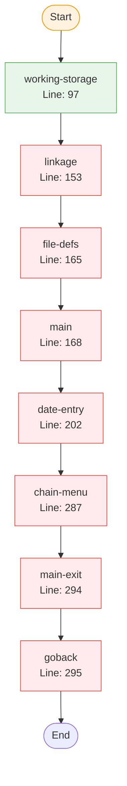
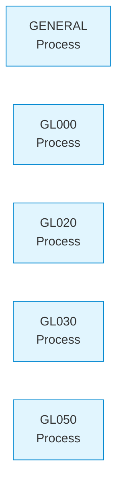
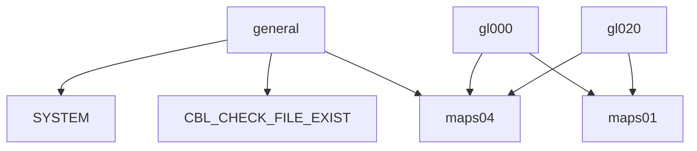

# General Ledger - System Visualizations

**Generated from Code**: 2025-09-15T16:57:46.771Z

## 1. System Context Diagram

```mermaid
graph TB
    %% Context Diagram - Generated from actual CALL analysis
    %% Subsystem: General_Ledger
    %% Internal Programs: 15
    %% External Dependencies: 6

    classDef internal fill:#e1f5e1,stroke:#4caf50,stroke-width:2px
    classDef external fill:#ffe0e0,stroke:#f44336,stroke-width:2px
    classDef subsystem fill:#e3f2fd,stroke:#2196f3,stroke-width:3px

    subgraph GeneralLedger["General Ledger"]
        general["GENERAL"]
        gl000["GL000"]
        gl020["GL020"]
        gl030["GL030"]
        gl050["GL050"]
        more["... and 10 more programs"]
    end

    CBLCHECKFILEEXIST["CBL_CHECK_FILE_EXIST"]:::external
    SYSTEM["SYSTEM"]:::external
    maps04["maps04"]:::external
    maps01["maps01"]:::external
    gl090a["gl090a"]:::external
    gl090b["gl090b"]:::external
    general --> maps04
    general --> CBLCHECKFILEEXIST
    general --> SYSTEM
    gl000 --> maps04
    gl000 --> maps01
    gl020 --> maps01
    gl020 --> maps04
    gl030 --> SYSTEM
    gl030 --> maps04
    gl050 --> maps04
    gl051 --> maps04
    gl051 --> SYSTEM
    gl060 --> SYSTEM
    gl060 --> maps04
    gl070 --> maps04
    gl072 --> SYSTEM
    gl090 --> gl090b
    gl090 --> gl090a
    gl105 --> SYSTEM
    gl120 --> SYSTEM

    class GeneralLedger subsystem
    class general internal
    class gl000 internal
    class gl020 internal
    class gl030 internal
    class gl050 internal
```

**Evidence**: Generated from 21 actual CALL statements in code
**Confidence**: 1.0 (from parsed AST)

## 2. Program Flow Diagrams

### GENERAL Flow

```mermaid
flowchart TD
    %% Program Flow - general
    %% Generated from PERFORM/GOTO analysis
    %% Sections: 54, PERFORMs: 0

    classDef performed fill:#e8f5e9,stroke:#4caf50
    classDef dead fill:#ffebee,stroke:#f44336
    classDef entry fill:#fff3e0,stroke:#ff9800

    Start([Start]):::entry
    S0["input-output<br/>Line: 189"]:::performed
    S1["file-control<br/>Line: 192"]:::dead
    S2["file<br/>Line: 199"]:::dead
    S3["working-storage<br/>Line: 203"]:::dead
    S4["General-Control<br/>Line: 341"]:::dead
    S5["goback<br/>Line: 355"]:::dead
    S6["goback<br/>Line: 360"]:::dead
    S7["File-Duplicates-In-Use<br/>Line: 364"]:::dead
    S8["end-if<br/>Line: 373"]:::dead
    S9["aa010-Get-System-Recs<br/>Line: 375"]:::dead
    S10["end-if<br/>Line: 395"]:::dead
    S11["display-menu<br/>Line: 486"]:::dead
    S12["Conv-date<br/>Line: 499"]:::dead
    S13["end-if<br/>Line: 518"]:::dead
    S14["conv-date-end<br/>Line: 520"]:::dead
    S15["display-go<br/>Line: 523"]:::dead
    S16["accept-loop<br/>Line: 568"]:::dead
    S17["call-system-setup<br/>Line: 590"]:::dead
    S18["pre-overrewrite<br/>Line: 611"]:::dead
    S19["goback<br/>Line: 628"]:::dead
    S20["end-if<br/>Line: 649"]:::dead
    S21["File-Duplicates-In-Use<br/>Line: 654"]:::dead
    S22["overclose<br/>Line: 670"]:::dead
    S23["goback<br/>Line: 671"]:::dead
    S24["load-it<br/>Line: 673"]:::dead
    S25["loader<br/>Line: 683"]:::dead
    S26["load00<br/>Line: 688"]:::dead
    S27["load00-exit<br/>Line: 700"]:::dead
    S28["load000<br/>Line: 704"]:::dead
    S29["file-defs<br/>Line: 712"]:::dead
    S30["load000-exit<br/>Line: 716"]:::dead
    S31["load01<br/>Line: 720"]:::dead
    S32["load02<br/>Line: 726"]:::dead
    S33["load03<br/>Line: 732"]:::dead
    S34["load04<br/>Line: 747"]:::dead
    S35["load05<br/>Line: 758"]:::dead
    S36["load06<br/>Line: 767"]:::dead
    S37["load07<br/>Line: 776"]:::dead
    S38["load08<br/>Line: 782"]:::dead
    S39["load09<br/>Line: 794"]:::dead
    S40["load10<br/>Line: 800"]:::dead
    S41["load11<br/>Line: 806"]:::dead
    S42["load12<br/>Line: 812"]:::dead
    S43["load13<br/>Line: 834"]:::dead
    S44["load25<br/>Line: 843"]:::dead
    S45["loadsr<br/>Line: 853"]:::dead
    S46["main-exit<br/>Line: 859"]:::dead
    S47["goback<br/>Line: 860"]:::dead
    S48["zz060-Convert-Date<br/>Line: 864"]:::dead
    S49["zz060-Exit<br/>Line: 896"]:::dead
    S50["exit<br/>Line: 897"]:::dead
    S51["maps04<br/>Line: 899"]:::dead
    S52["maps04-exit<br/>Line: 904"]:::dead
    S53["exit<br/>Line: 905"]:::dead
    Start --> S0
    S0 --> S1
    S1 --> S2
    S2 --> S3
    S3 --> S4
    S4 --> S5
    S5 --> S6
    S6 --> S7
    S7 --> S8
    S8 --> S9
    S9 --> S10
    S10 --> S11
    S11 --> S12
    S12 --> S13
    S13 --> S14
    S14 --> S15
    S15 --> S16
    S16 --> S17
    S17 --> S18
    S18 --> S19
    S19 --> S20
    S20 --> S21
    S21 --> S22
    S22 --> S23
    S23 --> S24
    S24 --> S25
    S25 --> S26
    S26 --> S27
    S27 --> S28
    S28 --> S29
    S29 --> S30
    S30 --> S31
    S31 --> S32
    S32 --> S33
    S33 --> S34
    S34 --> S35
    S35 --> S36
    S36 --> S37
    S37 --> S38
    S38 --> S39
    S39 --> S40
    S40 --> S41
    S41 --> S42
    S42 --> S43
    S43 --> S44
    S44 --> S45
    S45 --> S46
    S46 --> S47
    S47 --> S48
    S48 --> S49
    S49 --> S50
    S50 --> S51
    S51 --> S52
    S52 --> S53
    S53 --> End([End])
```

**Evidence**: From 54 sections, 0 PERFORM statements
**Warning**: 53 potentially dead code sections detected
### GL000 Flow

**Evidence**: From 8 sections, 0 PERFORM statements
**Warning**: 7 potentially dead code sections detected
## 3. Data Flow Diagram

**Evidence**: Generated from 0 file operations in code
**Files**: 0 data files accessed
## 4. Call Hierarchy

**Evidence**: 21 CALL relationships analyzed
**Root Programs**: general, gl000, gl020

## Diagram Validation

- ✅ All diagrams generated from actual code analysis
- ✅ Source programs and line numbers traceable
- ✅ "Generated from code" watermark included
- ✅ No assumptions - only documented relationships
