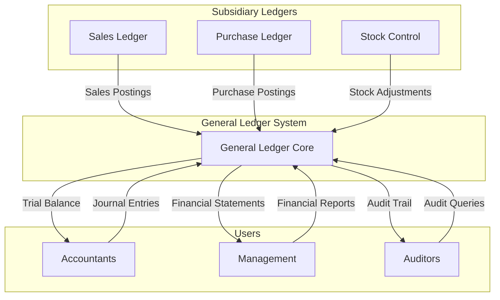
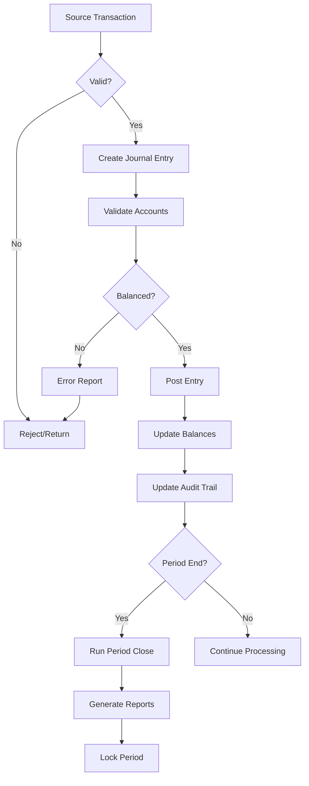
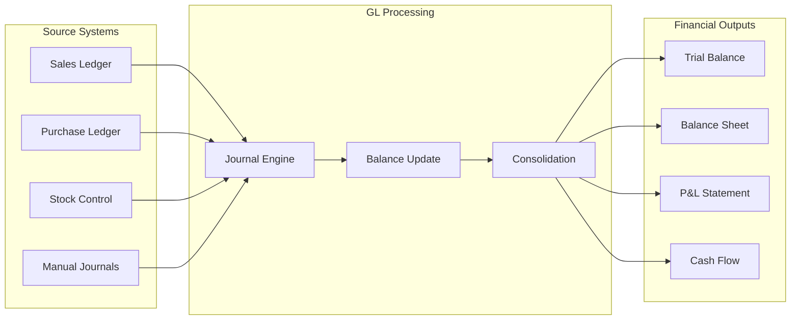
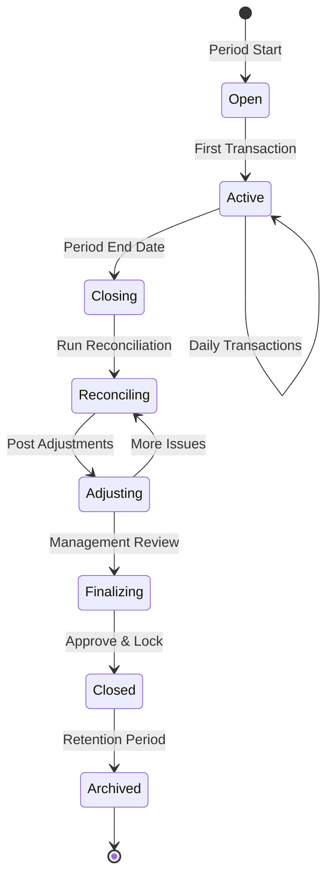

# General Ledger System - Visualizations

## 1. Context Diagram

```mermaid
graph TB
    subgraph "Subsidiary Ledgers"
        SL[Sales Ledger]
        PL[Purchase Ledger]
        ST[Stock Control]
    end
    
    subgraph "Users"
        ACC[Accountants]
        MGMT[Management]
        AUD[Auditors]
    end
    
    subgraph "General Ledger System"
        GL[General Ledger Core]
    end
    
    ACC -->|Journal Entries| GL
    MGMT -->|Financial Reports| GL
    AUD -->|Audit Queries| GL
    
    SL -->|Sales Postings| GL
    PL -->|Purchase Postings| GL
    ST -->|Stock Adjustments| GL
    
    GL -->|Trial Balance| ACC
    GL -->|Financial Statements| MGMT
    GL -->|Audit Trail| AUD
```
## 2. Functional Flow Diagram

```mermaid
flowchart TD
    A[Source Transaction] --> B{Valid?}
    B -->|Yes| C[Create Journal Entry]
    B -->|No| D[Reject/Return]
    C --> E[Validate Accounts]
    E --> F{Balanced?}
    F -->|Yes| G[Post Entry]
    F -->|No| H[Error Report]
    G --> I[Update Balances]
    I --> J[Update Audit Trail]
    J --> K{Period End?}
    K -->|Yes| L[Run Period Close]
    K -->|No| M[Continue Processing]
    L --> N[Generate Reports]
    N --> O[Lock Period]
    H --> D
```
## 3. Data Flow Diagram

```mermaid
graph LR
    subgraph "Source Systems"
        SL[Sales Ledger]
        PL[Purchase Ledger]
        ST[Stock Control]
        MAN[Manual Journals]
    end
    
    subgraph "GL Processing"
        JE[Journal Engine]
        BAL[Balance Update]
        CONS[Consolidation]
    end
    
    subgraph "Financial Outputs"
        TB[Trial Balance]
        BS[Balance Sheet]
        PL2[P&L Statement]
        CF[Cash Flow]
    end
    
    SL --> JE
    PL --> JE
    ST --> JE
    MAN --> JE
    
    JE --> BAL
    BAL --> CONS
    
    CONS --> TB
    CONS --> BS
    CONS --> PL2
    CONS --> CF
```
## 4. State Transition Diagram

```mermaid
stateDiagram-v2
    [*] --> Open: Period Start
    Open --> Active: First Transaction
    Active --> Closing: Period End Date
    Closing --> Reconciling: Run Reconciliation
    Reconciling --> Adjusting: Post Adjustments
    Adjusting --> Finalizing: Management Review
    Finalizing --> Closed: Approve & Lock
    Closed --> Archived: Retention Period
    Archived --> [*]
    
    Active --> Active: Daily Transactions
    Adjusting --> Reconciling: More Issues
```