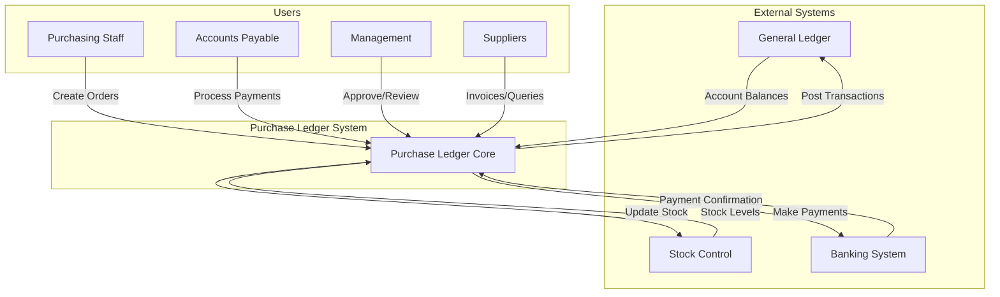
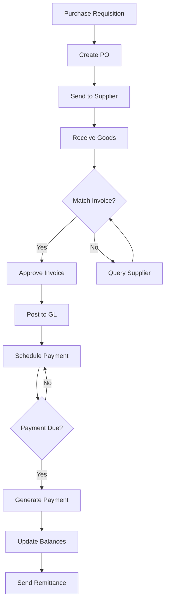
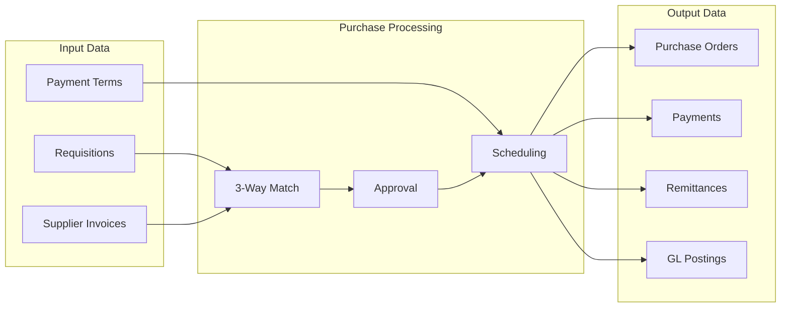
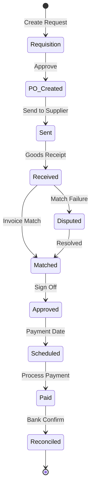

# Purchase Ledger Management - Visualizations

## 1. Context Diagram

```mermaid
graph TB
    subgraph "External Systems"
        GL[General Ledger]
        SC[Stock Control]
        BANK[Banking System]
    end
    
    subgraph "Users"
        PURCH[Purchasing Staff]
        AP[Accounts Payable]
        MGMT[Management]
        SUPP[Suppliers]
    end
    
    subgraph "Purchase Ledger System"
        PL[Purchase Ledger Core]
    end
    
    PURCH -->|Create Orders| PL
    AP -->|Process Payments| PL
    MGMT -->|Approve/Review| PL
    SUPP -->|Invoices/Queries| PL
    
    PL -->|Post Transactions| GL
    PL -->|Update Stock| SC
    PL -->|Make Payments| BANK
    GL -->|Account Balances| PL
    SC -->|Stock Levels| PL
    BANK -->|Payment Confirmation| PL
```
## 2. Functional Flow Diagram

```mermaid
flowchart TD
    A[Purchase Requisition] --> B[Create PO]
    B --> C[Send to Supplier]
    C --> D[Receive Goods]
    D --> E{Match Invoice?}
    E -->|Yes| F[Approve Invoice]
    E -->|No| G[Query Supplier]
    F --> H[Post to GL]
    H --> I[Schedule Payment]
    I --> J{Payment Due?}
    J -->|Yes| K[Generate Payment]
    J -->|No| I
    K --> L[Update Balances]
    L --> M[Send Remittance]
    G --> E
```
## 3. Data Flow Diagram

```mermaid
graph LR
    subgraph "Input Data"
        REQ[Requisitions]
        SINV[Supplier Invoices]
        TERMS[Payment Terms]
    end
    
    subgraph "Purchase Processing"
        MATCH[3-Way Match]
        APP[Approval]
        SCHED[Scheduling]
    end
    
    subgraph "Output Data"
        PO[Purchase Orders]
        PYMT[Payments]
        REM[Remittances]
        POST[GL Postings]
    end
    
    REQ --> MATCH
    SINV --> MATCH
    TERMS --> SCHED
    
    MATCH --> APP
    APP --> SCHED
    
    SCHED --> PO
    SCHED --> PYMT
    SCHED --> REM
    SCHED --> POST
```
## 4. State Transition Diagram

```mermaid
stateDiagram-v2
    [*] --> Requisition: Create Request
    Requisition --> PO_Created: Approve
    PO_Created --> Sent: Send to Supplier
    Sent --> Received: Goods Receipt
    Received --> Matched: Invoice Match
    Received --> Disputed: Match Failure
    Disputed --> Matched: Resolved
    Matched --> Approved: Sign Off
    Approved --> Scheduled: Payment Date
    Scheduled --> Paid: Process Payment
    Paid --> Reconciled: Bank Confirm
    Reconciled --> [*]
```